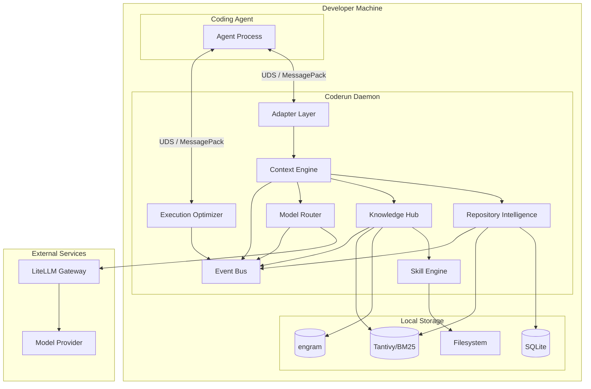
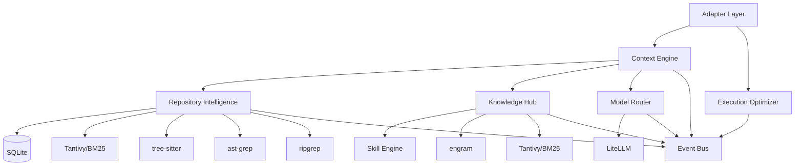

# Architecture

## Purpose

Define the complete v1 architecture of the AI Runtime for Coding Agents. This document describes how components relate, what each owns, and how data flows through the system.

## System Overview

The runtime is a single-process local daemon written in Rust. It receives coding tasks from a coding agent via native hooks (pre-generation and pre-tool-call), processes them through a pipeline of modules, and returns optimized context and model routing information. All processing happens on the developer's machine. The only external communication is to an LLM provider through LiteLLM.

The runtime exposes one clean API: `BuildContext(task)` plus a routing call. An external, optional orchestrator can be layered on top later as a separate product consuming this API.

## Architecture Diagram



## Module Responsibilities

| Module | Primary Responsibility | Key Operation |
|--------|----------------------|---------------|
| Adapter Layer | Bridge agent and daemon | intercept_before_generation, intercept_before_tool |
| Context Engine | Build token-budgeted Context Packs | BuildContext(task) |
| Repository Intelligence | Incremental AST parsing and search | index_repository, search_code, search_structural |
| Knowledge Hub | Store and retrieve all knowledge | store, retrieve, match_skills |
| Skill Engine | Deterministic tag-based skill matching | activate_skills, detect_conflicts |
| Model Router | Heuristic model tier selection | select_model |
| Execution Optimizer | Compress tool outputs via RTK | compress_output |
| Event Bus | Async observability events | emit(event) |

## Dependency Graph



## Process Model

### Single Daemon Process

The runtime runs as a single Rust daemon process. All modules execute within this process using async tasks on the tokio runtime. The daemon communicates with the coding agent over a Unix domain socket using MessagePack encoding.

```
┌──────────────────────────────────────────────────────────┐
│                  coderun daemon process                   │
│                                                          │
│  ┌──────────────────┐  ┌──────────────────────────────┐  │
│  │  Unix Socket     │  │     Module Pipeline           │  │
│  │  Server          │  │                              │  │
│  │  (MessagePack)   │  │  Adapter → Context Engine →  │  │
│  │                  │  │  RI + KH + SE + MR           │  │
│  └──────────────────┘  └──────────────────────────────┘  │
│                                                          │
│  ┌──────────────────┐  ┌──────────────────────────────┐  │
│  │  RTK Integration │  │     Local Storage             │  │
│  │  (tool output    │  │  - SQLite connection pool     │  │
│  │   compression)   │  │  - engram HTTP client         │  │
│  │                  │  │  - Tantivy index handles      │  │
│  │                  │  │  - Filesystem handles         │  │
│  └──────────────────┘  └──────────────────────────────┘  │
│                                                          │
│  ┌──────────────────────────────────────────────────┐    │
│  │              Event Bus (async channel)             │    │
│  └──────────────────────────────────────────────────┘    │
│                                                          │
└──────────────────────────────────────────────────────────┘
           │
           │  UDS / MessagePack
           ▼
  ┌─────────────────┐
  │  Coding Agent   │
  └─────────────────┘
```

### Thread Model

| Thread | Purpose |
|--------|---------|
| Main thread | Daemon lifecycle, signal handling, configuration loading |
| Unix socket server | Accepts connections from the coding agent |
| tokio async pool | Handles concurrent request processing |
| Tantivy background threads | Index merging and maintenance (managed by Tantivy) |
| SQLite connection pool | Concurrent database access |
| Event bus | Async event dispatch on separate task |

## Module Communication

### v1 Communication Pattern

Modules communicate through **direct function calls** within the daemon process. There is no message queue, event bus, or pub/sub on the hot path.

```
Adapter Layer
    │
    └──calls──→ Context Engine
                    │
                    ├──calls──→ Repository Intelligence
                    │               │
                    │               └──returns──→ SearchResults
                    │
                    ├──calls──→ Knowledge Hub
                    │               │
                    │               ├──calls──→ Skill Engine
                    │               │               │
                    │               │               └──returns──→ Vec<SkillMatch>
                    │               │
                    │               └──returns──→ Vec<KnowledgeEntry>
                    │
                    └──calls──→ Model Router
                                    │
                                    └──returns──→ RoutingDecision

                    └──returns──→ ContextPack

Adapter Layer
    │
    └──calls──→ Execution Optimizer
                    │
                    └──returns──→ CompressedOutput
```

### Event Bus (Async Only)

The event bus is strictly for observability. It is never in the `BuildContext` call path.

```
Context Engine ──emit──→ Event Bus ──consume──→ CLI Inspection
Model Router ──emit──→ Event Bus ──consume──→ Metrics
Repository Intelligence ──emit──→ Event Bus ──consume──→ Future Orchestrator
```

## Interface Contracts

### IContextBuilder

```rust
trait IContextBuilder {
    fn build_context(&self, task: TaskRequest) -> Result<ContextPack, ContextError>;
}
```

Reference implementation: Rust daemon with Unix socket IPC.

### IModelGateway

```rust
trait IModelGateway {
    fn select_model(&self, request: RoutingRequest) -> Result<RoutingDecision, RoutingError>;
    fn complete(&self, request: CompletionRequest) -> Result<CompletionResponse, CompletionError>;
}
```

Reference implementation: LiteLLM HTTP client.

### IWorkflowEngine

```rust
trait IWorkflowEngine {
    fn start_workflow(&self, workflow: WorkflowRequest) -> Result<WorkflowId, WorkflowError>;
    fn get_status(&self, id: WorkflowId) -> Result<WorkflowStatus, WorkflowError>;
}
```

Reference implementation: Not implemented in v1. Defined for future external orchestrator.

## Data Ownership

| Data | Owner | Storage | Lifecycle |
|------|-------|---------|-----------|
| Repository source code | Developer / Git | Filesystem (read-only) | Managed externally |
| Repository ASTs | Repository Intelligence | In-memory + cached | Rebuilt on incremental update |
| Repository metadata | Repository Intelligence | SQLite | Persistent across restarts |
| BM25/tantivy index | Repository Intelligence + Knowledge Hub | Tantivy directory | Persistent across restarts |
| Memory entries | Knowledge Hub | engram (SQLite+FTS5) | Persistent across restarts |
| Knowledge entries | Knowledge Hub | SQLite + Tantivy | Persistent across restarts |
| Skill definitions | Skill Engine | Community-format files | Persistent, developer-managed |
| Skill match results | Skill Engine | In-memory per request | Ephemeral |
| Context pack | Context Engine | In-memory per request | Ephemeral |
| Session fingerprint | Context Engine | In-memory per session | Lost on daemon restart (v1) |
| Token usage metrics | Context Engine | SQLite | Persistent across restarts |
| Configuration | Developer | TOML files | Persistent, developer-managed |
| Logs | Runtime | Log files | Persistent, rotated |
| Events | Event Bus | In-memory channel | Ephemeral (consumed by CLI/metrics) |

## Technology Stack (v0.2.0)

| Layer | Technology | Role |
|-------|------------|------|
| Language | Rust (>= 1.75) | Context Engine, daemon, all modules |
| Agent IPC | HTTP + JSON (axum) | Daemon ↔ Agent communication |
| AST Parsing | tree-sitter (embedded Rust crate) | Incremental AST parsing for Rust, Python, JS, TS |
| Text Search | ripgrep (grep-searcher crate) | Fast text search with .gitignore support |
| Full-text Index | tantivy | BM25 lexical scoring for docs/code |
| Reranking | FlashRank reranker with TF-IDF fallback | Search result reranking |
| Memory | engram (HTTP client) | Cross-session memory via HTTP |
| Model Gateway | LiteLLM (HTTP client) | Multi-provider routing, fallbacks |
| Directory Walking | ignore crate | .gitignore-aware file traversal |
| Database | SQLite via rusqlite | Index and metadata storage |
| Serialization | serde + toml + serde_json | Configuration and IPC |
| CLI | clap | Argument parsing |
| Logging | tracing + tracing-subscriber | Structured logging |
| Testing | cargo test + promptfoo | Unit tests + offline evaluation |
| Error Handling | anyhow + thiserror | Error types |
| Async Runtime | tokio | Async task management |
| HTTP Client | reqwest | LiteLLM and engram communication |
