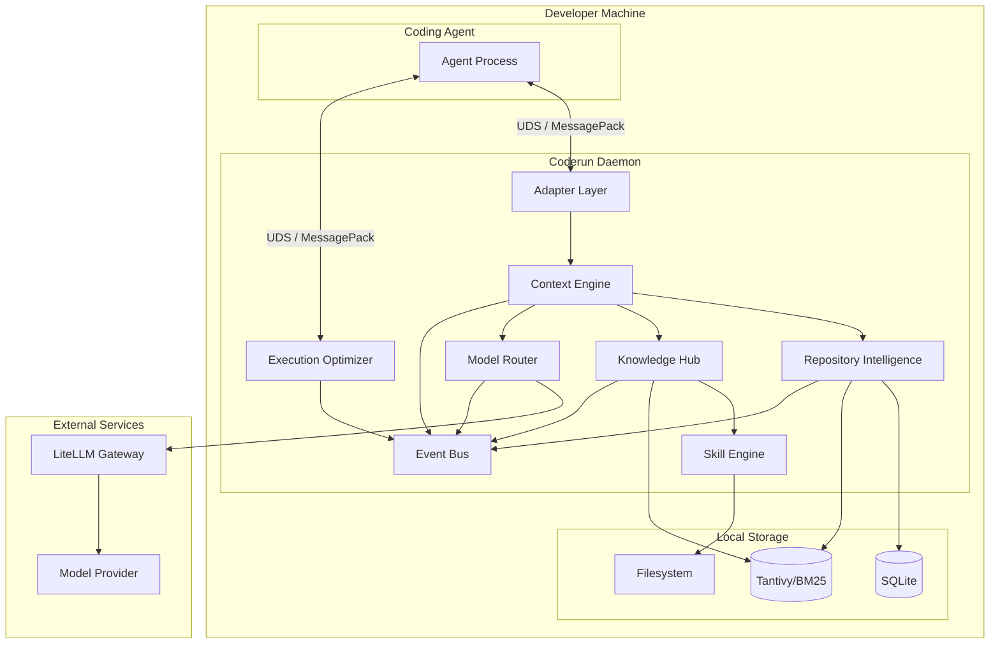
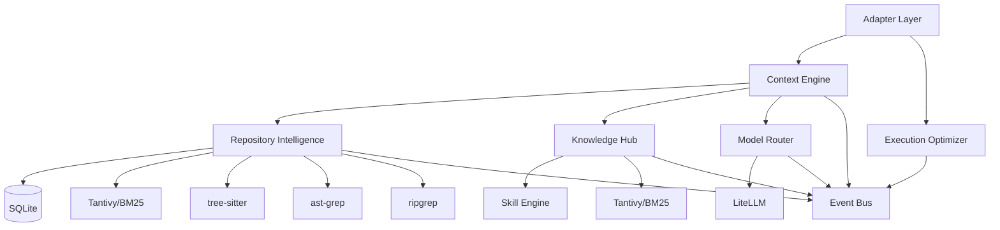

# Architecture

## Purpose

Define the complete v1 architecture of the AI Runtime for Coding Agents. This document describes how components relate, what each owns, and how data flows through the system.

## System Overview

The runtime is a single-process local daemon written in Rust. It receives coding tasks from a coding agent via native hooks (pre-generation and pre-tool-call), processes them through a pipeline of modules, and returns optimized context and model routing information. All processing happens on the developer's machine. The only external communication is to an LLM provider through LiteLLM.

The runtime exposes one clean API: `BuildContext(task)` plus a routing call. DBOS Transact over SQLite+Litestream was required since v0.6.0, but as of v0.7.5 it has been isolated to `future/workflow/` — the v1 runtime works without it. See `docs/02-workflows/DBOS.md` for workflow details.

## Architecture Diagram



## Module Responsibilities

| Module | Primary Responsibility | Key Operation |
|--------|----------------------|---------------|
| Adapter Layer | Bridge agent and daemon | intercept_before_generation, intercept_before_tool |
| Context Engine | Build token-budgeted Context Packs | BuildContext(task) |
| Repository Intelligence | Incremental AST parsing and search | index_repository, search_code, search_structural |
| Knowledge Hub | Store and retrieve all knowledge | store, retrieve, match_skills |
| Skill Engine | Deterministic tag-based skill matching | activate_skills, detect_conflicts |
| Model Router | Heuristic model tier selection | select_model |
| Execution Optimizer | Compress tool outputs via RTK | compress_output |
| Event Bus | Async observability events | emit(event) |

## Dependency Graph



## Process Model

### Single Daemon Process

The runtime runs as a single Rust daemon process. All modules execute within this process using async tasks on the tokio runtime. The daemon communicates with the coding agent over a Unix domain socket using MessagePack encoding.

```
┌──────────────────────────────────────────────────────────┐
│                  coderun daemon process                   │
│                                                          │
│  ┌──────────────────┐  ┌──────────────────────────────┐  │
│  │  Unix Socket     │  │     Module Pipeline           │  │
│  │  Server          │  │                              │  │
│  │  (MessagePack)   │  │  Adapter → Context Engine →  │  │
│  │                  │  │  RI + KH + SE + MR           │  │
│  └──────────────────┘  └──────────────────────────────┘  │
│                                                          │
│  ┌──────────────────┐  ┌──────────────────────────────┐  │
│  │  RTK Integration │  │     Local Storage             │  │
│  │  (tool output    │  │  - SQLite connection pool     │  │
│  │   compression)   │  │  - SQLite+tantivy local         │  │
│  │                  │  │  - Tantivy index handles      │  │
│  │                  │  │  - Filesystem handles         │  │
│  └──────────────────┘  └──────────────────────────────┘  │
│                                                          │
│  ┌──────────────────────────────────────────────────┐    │
│  │              Event Bus (async channel)             │    │
│  └──────────────────────────────────────────────────┘    │
│                                                          │
└──────────────────────────────────────────────────────────┘
           │
           │  UDS / MessagePack
           ▼
  ┌─────────────────┐
  │  Coding Agent   │
  └─────────────────┘
```

### Thread Model

| Thread | Purpose |
|--------|---------|
| Main thread | Daemon lifecycle, signal handling, configuration loading |
| Unix socket server | Accepts connections from the coding agent |
| tokio async pool | Handles concurrent request processing |
| Tantivy background threads | Index merging and maintenance (managed by Tantivy) |
| SQLite connection pool | Concurrent database access |
| Event bus | Async event dispatch on separate task |

## Module Communication

### v1 Communication Pattern

Modules communicate through **direct function calls** within the daemon process. There is no message queue, event bus, or pub/sub on the hot path.

```
Adapter Layer
    │
    └──calls──→ Context Engine
                    │
                    ├──calls──→ Repository Intelligence
                    │               │
                    │               └──returns──→ SearchResults
                    │
                    ├──calls──→ Knowledge Hub
                    │               │
                    │               ├──calls──→ Skill Engine
                    │               │               │
                    │               │               └──returns──→ Vec<SkillMatch>
                    │               │
                    │               └──returns──→ Vec<KnowledgeEntry>
                    │
                    └──calls──→ Model Router
                                    │
                                    └──returns──→ RoutingDecision

                    └──returns──→ ContextPack

Adapter Layer
    │
    └──calls──→ Execution Optimizer
                    │
                    └──returns──→ CompressedOutput
```

### Event Bus (Async Only)

The event bus is strictly for observability. It is never in the `BuildContext` call path.

```
Context Engine ──emit──→ Event Bus ──consume──→ CLI Inspection
Model Router ──emit──→ Event Bus ──consume──→ Metrics
Repository Intelligence ──emit──→ Event Bus ──consume──→ Future Orchestrator
```

## Interface Contracts

### IContextBuilder

```rust
trait IContextBuilder {
    fn build_context(&self, task: &TaskRequest) -> Result<(ContextPack, RoutingDecision), String>;
}
```

Reference implementation: Rust daemon with Unix socket IPC. Lock strategy: acquire all mutex guards once at the start of `build_context`, pass `&MutexGuard` references to helpers (`search_code_scored`, `retrieve_knowledge_scored`, `match_skills_scored`). This eliminates redundant lock contention and enables future parallelism via `tokio::join!`.

### IModelGateway

```rust
trait IModelGateway {
    fn select_model(&self, request: RoutingRequest) -> Result<RoutingDecision, RoutingError>;
    fn complete(&self, request: CompletionRequest) -> Result<CompletionResponse, CompletionError>;
}
```

Reference implementation: LiteLLM HTTP client.

### IWorkflowEngine (v0.6.0 — async native)

```rust
#[async_trait]
trait IWorkflowEngine {
    async fn start_workflow(&self, task: &TaskRequest, config: &Config) -> Result<String>;
    async fn get_status(&self, workflow_id: &str) -> Result<String>;
    async fn is_available(&self) -> bool;
}
struct NoopWorkflowEngine; // #[cfg(test)] only since v0.6.0
struct DBOSWorkflowEngine { endpoint: String, shared_secret: Option<String>, client: reqwest::Client } // v0.6.0: async reqwest + tokio::timeout(5s/3s/1s), Hmac<Sha256>
```

Reference: `crates/coderun-core/src/traits.rs:33-58` + `crates/coderun-workflow/src/dbos.rs`. `DBOSWorkflowEngine` implements `IWorkflowEngine` via `POST /workflow/start`. `NoopWorkflowEngine` for tests. `HMAC` via `hmac` crate `coderun-core/src/secrets.rs:verify_hmac`. See `docs/02-workflows/DBOS.md`.

## Data Ownership

| Data | Owner | Storage | Lifecycle |
|------|-------|---------|-----------|
| Repository source code | Developer / Git | Filesystem (read-only) | Managed externally |
| Repository ASTs | Repository Intelligence | In-memory + cached | Rebuilt on incremental update |
| Repository metadata | Repository Intelligence | SQLite | Persistent across restarts |
| BM25/tantivy index | Repository Intelligence + Knowledge Hub | Tantivy directory | Persistent across restarts |
| Memory entries | Knowledge Hub | SQLite+tantivy local | Persistent across restarts |
| Knowledge entries | Knowledge Hub | SQLite + Tantivy | Persistent across restarts |
| Skill definitions | Skill Engine | Community-format files | Persistent, developer-managed |
| Skill match results | Skill Engine | In-memory per request | Ephemeral |
| Context pack | Context Engine | In-memory per request | Ephemeral |
| Session fingerprint | Context Engine | In-memory per session | Lost on daemon restart (v1) |
| Token usage metrics | Context Engine | SQLite | Persistent across restarts |
| Configuration | Developer | TOML files | Persistent, developer-managed |
| Logs | Runtime | Log files | Persistent, rotated |
| Events | Event Bus | In-memory channel | Ephemeral (consumed by CLI/metrics) |

### SQLite as Persistence Backbone

SQLite is the primary persistence layer for all structured metadata:

- **Files:** file paths, content hashes, metadata (tracked for incremental re-indexing)
- **Symbols:** AST-extracted symbols (functions, classes, methods) with file associations
- **Knowledge:** documents ingested from README, ADRs, and other sources
- **Sessions:** session fingerprints for deduplication, token usage metrics
- **Graph:** dependency edges between files (import/use/require relationships)

Tantivy is the search index (full-text BM25). Tree-sitter is the parser. Graph is the relationship layer. All three are built from the same source code walk during `coderun init`.

## Initialization Pipeline

`coderun init` runs a 7-step pipeline:

```
[1/7] Scaffold (.coderun/, config, skills, database)
[2/7] Repository discovery + language detection
[3/7] Parser validation (verify tree-sitter grammars load)
[4/7] Indexing (full-text BM25 + symbol extraction + dependency graph)
[5/7] Knowledge Hub initialization + skill loading
[6/7] Validation queries (smoke test all components)
[7/7] Repository status report
```

Each step is fail-open: errors in one step don't block subsequent steps. The validation step probes Tantivy, SQLite symbols, graph edges, knowledge entries, and skills independently.

## Retrieval Status

`RetrievalStatus` distinguishes between different failure modes:

```rust
pub enum RetrievalStatus {
    Found(usize),              // Results were found
    NoMatch,                   // Search ran successfully but found nothing
    IndexNotBuilt,             // No index exists (init never ran)
    IndexUnavailable,          // Index exists but is empty/unreachable
    ParserFailed(Vec<String>), // Tree-sitter grammars failed to load
    KnowledgeHubUnavailable,   // Knowledge Hub not initialized
    RetrievalFailed(String),   // Search threw an error
    FallbackUsed(String),      // Used fallback method (e.g. ripgrep after Tantivy miss)
}
```

This enables the daemon to report structured diagnostics instead of generic "no results" when retrieval fails.

## Technology Stack

| Layer | Technology | Role |
|-------|------------|------|
| Language | Rust (>= 1.75) | Context Engine, daemon, all modules (`coderun-workflow` new) |
| Agent IPC | UDS + MessagePack primary (`rmp-serde`+`tokio::net::UnixListener`) + HTTP/JSON fallback (`axum`) on `127.0.0.1:9527` | Daemon ↔ Agent; `POST /hook`, `GET /metrics`, `POST /workflow/*` |
| AST Parsing | tree-sitter **111 languages** via arborium bundle (no feature flags) | `repo-intel/src/parser.rs` |
| Structural Search | `sg-core` gated `search_structural()` first-class, `search_structural_fallback()` only on `Err` | `repo-intel/src/lib.rs:352` |
| Text Search | ripgrep (`grep-searcher`+`grep-regex`+`ignore`) | `search_text()` |
| Full-text Index | tantivy `MmapDirectory` (in-process) | `storage/src/tantivy_index.rs` + `search_fulltext()` wiring |
| Dependency Graph | `graph.rs` adjacency (`import`/`use`/`require`) + `edges` table `003_graph.sql` (local AST+regex) | `repo-intel/src/graph.rs` |
| Watcher | `notify+git2` incremental `diff_tree_to_workdir` first-class (feature `git-watcher` default), polling 5s fallback only on `Err` | `repo-intel/src/watcher.rs` |
| LSP | Stub `LspClient` (`CODERUN_LSP_ENABLED=true` → probe, never hard dep) | `repo-intel/src/lsp.rs` |
| Reranking | Removed from v1 runtime per benchmark evaluation (passthrough only) — see `FLASHRANK_REMOVAL.md` | `knowledge/src/rerank.rs` |
| Memory | SQLite+tantivy local (engram removed — see `ENGRAM_CBM_REMOVAL.md`) | `coderun-storage` local | |
| Model Gateway | LiteLLM HTTP + heuristic `capable→balanced→fast` `fallback_chain()` + `cost_usd` | `router/src/litellm.rs` + `src/lib.rs:223` |
| Compression | RTK `RtkAdapter::detect()` (binary if present, `~10ms`) → built-ins + tee `~/.coderun/logs/tool-failures/` | `optimizer/src/rtk.rs` |
| Token Counting | `tiktoken-rs` `cl100k_base` + `heuristic` fallback | `context/src/lib.rs:389`/`optimizer/src/lib.rs:303` |
| Orchestration | DBOS Transact (isolated to `future/workflow/` since v0.7.5, not required for v1) | `future/workflow/` |
| Metrics | Prometheus exposition (`GET /metrics` histogram `coderun_build_context_duration_seconds`) + Grafana `docs/dashboards/coderun.json` | `daemon/src/metrics.rs` + `deploy/prometheus/alerts.yml` |
| Rate Limit | Token-bucket 10/s burst 20 per `session_id` + `HMAC-SHA256` `X-Coderun-Signature` via `hmac` crate `secrets::verify_hmac` (was `sha256(secret+body)` pre-v0.6.0) | `daemon/src/ratelimit.rs` + `core/src/secrets.rs` |
| Concurrency | `RwLock<ContextEngine>` (was `Mutex`), `session_fingerprints` SHA-256 dedup, per-session memory namespace | `daemon/src/adapter.rs:44` + `context/src/lib.rs:142` |
| Directory Walking | `ignore` crate | `.gitignore` |
| Database | SQLite `rusqlite` bundled + WAL + `r2d2` pool, migrations `001-005` (`005` = `audits`+`workflows` DBOS required) | `storage/src/lib.rs:21` |
| Serialization | `serde`+`toml`+`serde_json`+`serde_yaml`+`rmp-serde` | Config + IPC (MessagePack canonical) |
| CLI | `clap` + `reqwest` blocking for `workflow approve` health probe | `coderun-cli` (8 probes v0.4.0) |
| Logging | `tracing`+`tracing-subscriber` (json `fmt`) | `daemon` |
| Testing/Bench | `cargo test` (165 tests) + `promptfoo` + `criterion` `benches/context_bench.rs` (p95 <50ms) | `benches/` |
| Distribution | `Dockerfile` (distroless), `Formula/coderun.rb` (brew tap+launchd), `cargo-wix` MSI | `deploy/` |
| Async Runtime | `tokio` full | `daemon`+`workflow` |
| HTTP Client | `reqwest` (LiteLLM, DBOS) | `router`+`workflow` |
