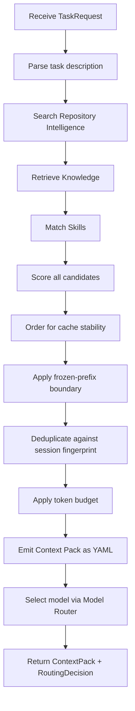
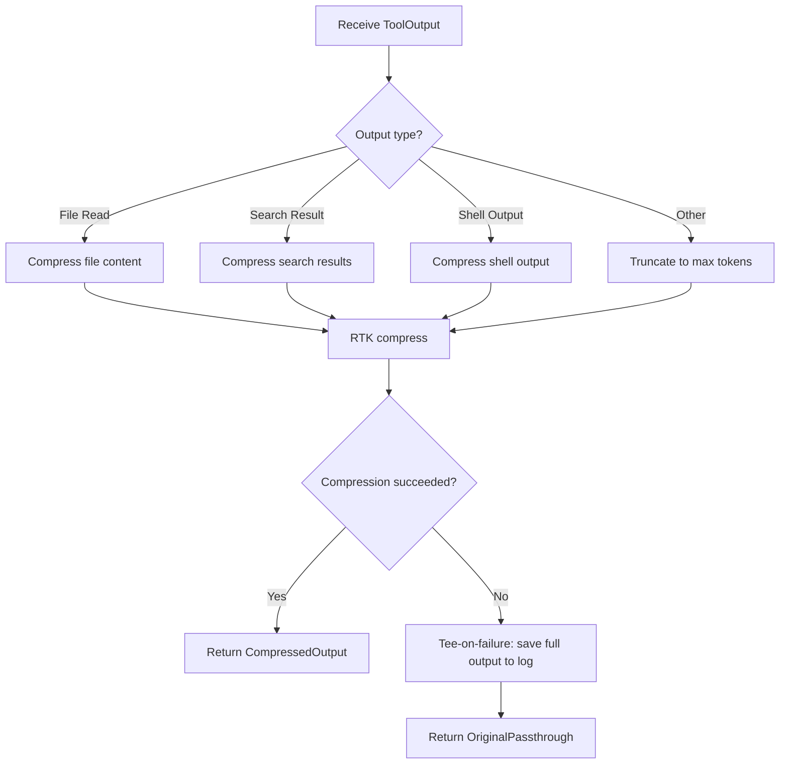

# Components

## Purpose

Define every v1 module in detail. Each module section specifies purpose, responsibilities, inputs, outputs, dependencies, persistent data, runtime behavior, errors, boundaries, and implementation requirements.

---

## 1. Adapter Layer

### Purpose

Bridge the coding agent and the daemon. One thin adapter per agent CLI, implementing two operations: intercept-before-generation (rewrite the message) and intercept-before-tool-call (allow/deny/modify).

### v0.2.0 Implementation

- **HTTP server** (axum) on port 9527 with JSON IPC
- **Fail-open** on timeout or error: returns OriginalPassthrough
- **OpenCode plugin** (TypeScript) for pre-generation and pre-tool hooks
- **Claude Code hooks** (shell scripts) for UserPromptSubmit and PreToolUse

### Responsibilities

- Accept HTTP connections from agents
- Parse JSON-encoded requests
- Validate request format and content
- Generate correlation IDs
- Route requests to the appropriate handler (Context Engine or Execution Optimizer)
- Format responses in agent-consumable JSON
- Implement fail-open on timeout or error
- Handle agent-specific hook differences

### Inputs

| Input | Type | Description |
|-------|------|-------------|
| PreGeneration | MessageRewrite | Session ID, message, optional context hints |
| PreToolCall | ToolOutput | Tool name, output type, content, optional context |

### Outputs

| Output | Type | Description |
|--------|------|-------------|
| RewrittenMessage | ContextPack + RoutingDecision | Rewritten message with injected context |
| CompressedOutput | Compressed tool output | Token-reduced tool output |
| OriginalPassthrough | Original message + reason | Fail-open: unmodified message |

### Dependencies

- Context Engine (for pre-generation)
- Execution Optimizer (for pre-tool-call)
- tokio (async I/O)
- rmp-serde (MessagePack)

### Persistent Data

None. The Adapter Layer is stateless.

### Runtime Behavior

1. Accept UDS connection from agent
2. Read MessagePack-encoded request
3. Parse and validate request
4. Generate correlation ID (`req_{uuid}`)
5. Start tracing span with correlation ID
6. Route to appropriate handler:
   - PreGeneration → Context Engine `BuildContext`
   - PreToolCall → Execution Optimizer `compress_output`
7. On success: return formatted response
8. On timeout (> 30s) or error: return OriginalPassthrough
9. Log request received and response sent

### Errors

| Error | Behavior |
|-------|----------|
| Invalid MessagePack | Return OriginalPassthrough with reason "invalid_request" |
| Missing required field | Return OriginalPassthrough with reason "invalid_request" |
| Timeout | Return OriginalPassthrough with reason "timeout" |
| Internal error | Return OriginalPassthrough with reason "fail-open" |

### Boundaries

- Does not access repository directly
- Does not build context packs
- Does not compress tool outputs
- Only translates between agent format and daemon format
- Must be thin: minimal logic, fast execution

### Agent-Specific Adapters

#### opencode Adapter

| Hook | Runtime Operation |
|------|-------------------|
| `chat.message` (pre-generation) | Call Context Engine, rewrite message |
| `tool.execute.before` (pre-tool) | Call Execution Optimizer, compress output |

#### Claude Code Adapter

| Hook | Runtime Operation |
|------|-------------------|
| `UserPromptSubmit` (pre-generation) | Call Context Engine, rewrite message. **Hard 30s timeout.** |
| `PreToolUse` (pre-tool) | Call Execution Optimizer, compress output |

### Implementation Requirements

- Use tokio for async UDS server
- Use rmp-serde for MessagePack encoding/decoding
- Use uuid crate for correlation ID generation
- Validate all input before passing to modules
- Log every request and response at INFO level
- Include correlation ID in all log entries
- Implement 30s timeout for Claude Code hooks
- Return OriginalPassthrough on any error

---

## 2. Context Engine

### Purpose

The central module and one public entry point: `BuildContext(task)`. Retrieves relevant information, ranks and reranks results, deduplicates, compresses, orders for cache stability, enforces token budgets, and emits a Context Pack as YAML.

### Responsibilities

- Coordinate Repository Intelligence, Knowledge Hub, and Model Router
- Assemble context from multiple sources
- Order context for cache stability: skills → docs → code
- Apply frozen-prefix boundary
- Enforce token budgets
- Manage session fingerprint to avoid duplicate content
- Track token usage per request
- Emit Context Pack as YAML
- Run as a long-lived daemon process

### Inputs

| Input | Type | Description |
|-------|------|-------------|
| BuildContext | TaskRequest | Task description, session ID, context hints |

### Outputs

| Output | Type | Description |
|--------|------|-------------|
| ContextPack | YAML | Three sections: behavioral_skills, docs_context, code_context |
| RoutingDecision | Model selection | Model name, tier, reasoning |

### Dependencies

- Repository Intelligence (code search and file content)
- Knowledge Hub (knowledge retrieval and skill matching)
- Model Router (model selection)
- tiktoken-rs (local token counting)
- tokio (async runtime)

### Persistent Data

| Data | Storage | Purpose |
|------|---------|---------|
| Token usage | SQLite `token_usage` table | Track token consumption per request |
| Session fingerprint | In-memory (per session) | Avoid duplicate context |

### Runtime Behavior

#### BuildContext Pipeline



#### Cache-Aware Ordering

The Context Pack is ordered in this fixed sequence for maximum prompt cache stability:

```yaml
# Section 1: Most cache-stable (byte-identical across many tasks)
behavioral_skills:
  - name: "Add Rate Limiting"
    instructions: "..."
  - name: "Error Handling Pattern"
    instructions: "..."

# Frozen-prefix boundary: everything above is cache-stable
# Everything below changes between tasks

# Section 2: Moderately cache-stable (changes rarely)
docs_context:
  - path: "docs/architecture.md"
    content: "..."
  - path: "docs/conventions.md"
    content: "..."

# Section 3: Least cache-stable (changes frequently)
code_context:
  - path: "src/router.ts"
    content: "..."
    line_range: [1, 50]
  - path: "src/middleware/auth.ts"
    content: "..."
    line_range: [1, 30]
```

#### Token Budget Allocation

| Source | Budget Allocation | Priority | Cache Stability |
|--------|-------------------|----------|-----------------|
| behavioral_skills | 20% of budget | 1 (highest) | Highest |
| docs_context | 15% of budget | 2 | Medium |
| code_context | 55% of budget | 3 | Lowest |
| metadata (implicit) | 10% of budget | 4 | N/A |

#### Deduplication

1. Compute SHA-256 hash of each content block
2. Check hash against session fingerprint
3. If hash already in fingerprint: skip content block
4. If hash not in fingerprint: include and add to fingerprint

#### Token Estimation

- Use tiktoken-rs for token counting (local, no API round-trip)
- Fallback: estimate 1 token per 4 characters for non-English content
- Count tokens for each content block before inclusion

### Errors

| Error | Behavior |
|-------|----------|
| Repository search failure | Continue with empty code_context |
| Knowledge retrieval failure | Continue with empty docs_context |
| Skill matching failure | Continue with empty behavioral_skills |
| Token estimation failure | Use character-based estimation |
| Model routing failure | Use default model tier |
| Any unrecoverable error | Return OriginalPassthrough (fail-open) |

### Boundaries

- Does not search the repository directly (delegates to Repository Intelligence)
- Does not retrieve knowledge directly (delegates to Knowledge Hub)
- Does not match skills directly (delegates to Skill Engine via Knowledge Hub)
- Does not select models directly (delegates to Model Router)
- Orchestrates and assembles the final output
- Must complete within 30 seconds (fail-open on timeout)

### Implementation Requirements

- Build in Rust for predictable low memory, no GC-pause latency
- Embed tree-sitter/ast-grep/ripgrep as native Rust crates (not shelled out)
- Run as a long-lived daemon, not spawn-per-request
- Communicate with Adapter Layer over Unix domain socket with MessagePack
- Memory-map retrieval indices rather than loading fully into RAM
- Quantize reranker model (int8 ONNX) for RAM savings
- Use tiktoken-rs for local token counting
- Enforce 30s timeout, return OriginalPassthrough on exceed
- Log token usage at every stage
- Emit ContextBuilt event on completion

---

## 3. Repository Intelligence

### Purpose

Parse, index, and search the codebase incrementally. Uses tree-sitter for incremental AST parsing, ripgrep for text search. Updated on git changes, not per-request.

### v0.2.0 Implementation

- **tree-sitter** for AST parsing (Rust, Python, JavaScript, TypeScript)
- **ripgrep** (grep-searcher) for fast text search with .gitignore support
- **ignore crate** for respecting .gitignore patterns
- **Regex fallback** for unsupported languages
- **Incremental indexing** via SHA-256 content hashing

### Responsibilities

- Walk repository directory tree
- Parse source files with tree-sitter (incremental)
- Extract symbols (functions, classes, structs, enums, imports)
- Store file metadata and symbol information in SQLite
- Search code by text (ripgrep) with .gitignore support
- Detect project type and language distribution
- Track file changes for incremental updates

### Inputs

| Input | Type | Description |
|-------|------|-------------|
| index_repository | Path | Repository root path to index |
| search_text | SearchQuery | Text search query with filters |
| search_structural | StructuralQuery | AST pattern search query |
| search_fulltext | FulltextQuery | Full-text search query |
| get_file_info | Path | Get metadata for a specific file |
| get_symbol_info | SymbolQuery | Find symbol definitions and references |
| get_file_content | Path | Read file content with line range |

### Outputs

| Output | Type | Description |
|--------|------|-------------|
| IndexResult | Index statistics | Files indexed, symbols extracted, duration |
| SearchResults | Vec<SearchResult> | Ranked search results with file paths, line numbers, context |
| FileInfo | File metadata | Path, size, language, symbol count, last modified |
| SymbolInfo | Symbol details | Name, kind, location, references |
| FileContent | String | File content with line numbers |

### Dependencies

- tree-sitter (embedded Rust crate, not shelled out)
- ast-grep (embedded Rust crate, not shelled out)
- ripgrep (embedded Rust crate, not shelled out)
- BM25/tantivy (in-process)
- SQLite (metadata storage)
- Filesystem (source code reads)
- Optional: LSP (agent's own language server processes)

### Persistent Data

| Data | Storage | Purpose |
|------|---------|---------|
| File metadata | SQLite `files` table | Track indexed files |
| Symbol information | SQLite `symbols` table | Track code structure |
| Full-text index | BM25/tantivy directory | Enable full-text search |
| Language statistics | SQLite | Project composition analysis |

### Runtime Behavior

#### Indexing (Triggered by Git Change)

1. Detect git change (file system watcher or manual trigger)
2. Walk directory tree, skip ignored paths
3. For each recognized source file:
   a. Read file content
   b. Compute content hash
   c. Check if file already indexed with same hash
   d. If unchanged: skip
   e. If new or changed: parse with tree-sitter (incremental)
   f. Extract symbols and structure
   g. Add to BM25/tantivy index
   h. Store metadata in SQLite
4. Remove deleted files from index
5. Emit RepositoryUpdated event
6. Log indexing statistics

#### Text Search

1. Receive search query with pattern and optional filters
2. Execute ripgrep (in-process) with pattern and filters
3. Parse results into SearchResults
4. Rank by relevance (ripgrep relevance + file proximity)
5. Return top N results

#### Structural Search

1. Receive AST pattern
2. Execute ast-grep (in-process) with pattern
3. Parse results into SearchResults
4. Return matching code locations

#### Full-text Search

1. Receive search query
2. Search BM25/tantivy index
3. Parse results with snippets
4. Return ranked results

### Errors

| Error | Behavior |
|-------|----------|
| File not found | Skip file, log warning, continue indexing |
| Parse failure | Skip file, log warning, continue indexing |
| Index write failure | Retry once, then fail index operation |
| SQLite write failure | Fatal — cannot persist index |
| tree-sitter grammar missing | Skip language, log warning |
| ast-grep not available | Degraded — structural search unavailable |

### Boundaries

- Does not interpret code semantics
- Does not make AI-based relevance judgments
- Does not modify source code
- Does not manage version control
- Only reads repository, never writes to it (except to .coderun/)
- Optional LSP enrichment is never a hard dependency

### Implementation Requirements

- Embed tree-sitter as native Rust crate (tree-sitter crate)
- Embed ast-grep as native Rust crate
- Embed ripgrep as native Rust crate
- Use tantivy crate for BM25 indexing and search
- Use rusqlite for database operations
- Implement incremental indexing via content hash comparison and tree-sitter's incremental parsing
- Cache tree-sitter parsers in memory for repeated use
- Handle binary files gracefully (skip, do not crash)
- Log indexing progress every 100 files
- Emit RepositoryUpdated event when indexing completes

---

## 4. Knowledge Hub

### Purpose

One organizational surface for project docs, skills, rules, ADRs, templates, and long-term memory. Composes three retrieval strategies: tag-based skill matching, lexical search with reranking for docs/code, and engram for memory.

### v0.2.0 Implementation

- **SQLite** for knowledge storage with LIKE-based search
- **engram** HTTP client for cross-session memory
- **Reranker** passthrough (FlashRank removed from v1 per benchmark — see `FLASHRANK_REMOVAL.md`)
- **Pattern detection** for knowledge extraction (naming, architectural, domain)

### Responsibilities

- Store and retrieve knowledge entries across all categories
- Manage skill registry and tag-based matching
- Perform lexical search for docs and code
- Store and retrieve memory via engram
- Detect and extract knowledge from indexed code
- Decay confidence of unused knowledge

### Inputs

| Input | Type | Description |
|-------|------|-------------|
| store_knowledge | KnowledgeEntry | Knowledge to store |
| retrieve_knowledge | KnowledgeQuery | Query to find relevant knowledge |
| match_skills | SkillMatchQuery | Task description for skill matching |
| extract_knowledge | ExtractRequest | Extract knowledge from code analysis |
| memory_save | MemoryEntry | Save to engram memory |
| memory_search | MemoryQuery | Search engram memory |

### Outputs

| Output | Type | Description |
|--------|------|-------------|
| Vec<KnowledgeEntry> | Knowledge entries | Retrieved knowledge ranked by relevance |
| Vec<SkillMatch> | Matched skills | Skills with scores and full instructions |
| MemorySearchResult | Memory entries | Relevant memory from engram |

### Dependencies

- SQLite (knowledge storage)
- BM25/tantivy (knowledge and docs search index)
- engram (memory storage and retrieval)

### Persistent Data

| Data | Storage | Purpose |
|------|---------|---------|
| Knowledge entries | SQLite `knowledge` table | Store knowledge with metadata |
| Knowledge index | BM25/tantivy | Enable full-text search of knowledge |
| Memory entries | engram (SQLite+FTS5) | Persistent cross-session memory |

### Runtime Behavior

#### Knowledge Retrieval

1. Receive query string and optional category filter
2. Search BM25/tantivy index for matching entries
3. Retrieve top 20 candidates
4. Filter by minimum confidence threshold (0.3)
6. Return top 10 results

#### Skill Matching

1. Receive task description
2. For each skill in registry:
   a. Extract trigger tags
   b. Compute tag overlap score with task description
   c. Apply category bonus if task matches skill tags
   d. Compute final match score
3. Sort by score descending
4. Return top N matches with score > 0.3
5. Inject full skill instructions (not just descriptions)

#### Memory Operations

1. **Read (deterministic, in hot path):**
   a. Receive query from Context Engine
   b. Call engram HTTP API with query
   c. Return relevant memory entries
2. **Write (async, agent-invoked):**
   a. Receive memory entry from agent
   b. Call engram HTTP API to save
   c. Optionally scan for semantic conflicts
   d. Emit MemorySaved event

#### Knowledge Extraction

1. Receive code analysis results from Repository Intelligence
2. Detect naming patterns (e.g., files use snake_case)
3. Detect architectural patterns (e.g., controller-service-repo)
4. Detect domain terms (e.g., "mission" in this project means "task")
5. Store detected knowledge with confidence based on evidence strength

### Errors

| Error | Behavior |
|-------|----------|
| SQLite write failure | Log warning, continue without storing |
| BM25/tantivy write failure | Log warning, continue without indexing |
| engram unreachable | Continue without memory, log warning |
| engram unreachable | Continue without memory, log warning |
| Duplicate key | Merge with existing entry |

### Boundaries

- Does not perform code analysis (receives analysis from Repository Intelligence)
- Does not make AI-based knowledge judgments (uses pattern detection only)
- Does not expose knowledge to the coding agent directly
- Only provides knowledge through the Context Engine
- Skills are matched by tag-based scoring, not by the same ranking pipeline as docs/code

### Implementation Requirements

- Use SQLite for knowledge storage
- Use BM25/tantivy for knowledge search
- Use engram HTTP API for memory operations
- Knowledge categories: `convention`, `pattern`, `domain`, `decision`
- Each knowledge entry has: id, category, key, value, confidence, source, created_at, updated_at
- Skill registry loaded from community-format files at daemon startup
- Implement confidence decay as a background task

---

## 5. Skill Engine

### Purpose

Deterministic tag-based skill matching against a small registry. Task classification, skill activation, conflict detection, priority, and instruction injection. No LLM call, no agent browsing of skill descriptions at request time.

### Responsibilities

- Load skill definitions from community-format files (Claude, Cursor, Continue, agentskills.io)
- Validate skill schema
- Classify tasks using signals shared with Model Router
- Match skills to tasks using tag-based scoring
- Detect conflicts between matched skills
- Resolve priority when multiple skills match
- Return full skill instructions for injection

### Inputs

| Input | Type | Description |
|-------|------|-------------|
| match_skills | SkillMatchQuery | Task description and context for matching |
| get_skill | String | Skill name for direct retrieval |
| reload_skills | None | Reload all skill definitions from disk |
| list_skills | None | List all loaded skills |

### Outputs

| Output | Type | Description |
|--------|------|-------------|
| Vec<SkillMatch> | Matched skills | Skills with match scores and full instructions |
| Skill | Full skill definition | Complete skill with all fields |
| Vec<String> | Skill names | List of available skill names |

### Dependencies

- Filesystem (skill definition files)
- No external services

### Persistent Data

| Data | Storage | Purpose |
|------|---------|---------|
| Skill definitions | Community-format files | Developer-managed skill content |
| Skill registry | In-memory | Loaded at daemon startup |

### Runtime Behavior

#### Skill Loading

1. Scan skill directory for community-format files (.md, .toml, .yaml)
2. Parse each file according to its format
3. Validate required fields: `name`, `tags`/`trigger`, `instructions`
4. Validate optional fields: `description`, `examples`, `constraints`
5. Load valid skills into in-memory registry
6. Log count of loaded skills
7. Warn on invalid files, skip them

#### Task Classification

The Skill Engine reuses the same signals as the Model Router for task classification:
- Structural complexity (files involved, symbols referenced)
- Semantic complexity (task description, technical terms, action verbs)
- Scope (context size, knowledge entries)

#### Skill Matching

1. Receive task description
2. Classify task using shared signals
3. For each skill in registry:
   a. Extract tag keywords
   b. Compute tag overlap score with task description
   c. Apply category bonus if task matches skill tags
   d. Compute final match score
4. Sort by score descending
5. Filter: score > 0.3
6. Detect conflicts (contradictory instructions)
7. Resolve priority (higher score wins)
8. Take top N (configured, default 5)
9. Return full instructions (not just descriptions)

#### Conflict Detection

1. Compare instructions of matched skills
2. Flag pairs with contradictory constraints
3. If conflicts found: keep higher-priority skill, log warning
4. Do not inject conflicting instructions

### Skill Format (Community)

```markdown
# Add Rate Limiting

## Tags
rate limit, throttle, request limit, API limit, middleware, security

## Instructions
1. Check existing middleware patterns in the project
2. Create a rate limiter module following project conventions
3. Apply to target routes
4. Add configuration for rate limits
5. Add tests for rate limiting behavior

## Examples
- Add global rate limiting: src/middleware/rate_limit.rs, src/config.rs

## Constraints
- Do not modify authentication logic
- Use the project's existing error handling pattern
- Make rate limits configurable via environment variables
```

### Errors

| Error | Behavior |
|-------|----------|
| Invalid file format | Skip file, log warning |
| Missing required fields | Skip file, log warning |
| Skill directory not found | Log warning, operate with zero skills |
| File read error | Skip file, log warning |

### Boundaries

- Does not execute skills
- Does not modify code based on skills
- Does not enforce skill constraints
- Only provides skill instructions to the Context Engine
- Skills are advisory, not mandatory
- Registry is small (dozens, not thousands)

### Implementation Requirements

- Parse community-format files (Markdown, TOML, YAML)
- Validate skill schema on load
- Store skills in `Vec<Skill>` after loading
- Skill matching uses deterministic tag scoring (no AI)
- Tags are case-insensitive
- Match score = (matched tags / total tags) * category_bonus
- Category bonus: 1.2 if task matches skill tags, 1.0 otherwise
- Full skill instructions injected directly (small, already determined relevant)

---

## 6. Model Router

### Purpose

Select the appropriate LLM model for a given task based on heuristic complexity scoring. No LLM call decides the tier.

### v0.2.0 Implementation

- **Heuristic scoring** with structural, semantic, and scope factors
- **Tier selection** (fast, balanced, capable) based on score thresholds
- **LiteLLM client** for multi-provider model routing
- **Model override** support from request parameters

### Responsibilities

- Score task complexity using heuristic
- Select model tier (fast, balanced, capable)
- Map tier to specific model name
- Return routing decision with reasoning
- Configure LiteLLM for the selected model

### Inputs

| Input | Type | Description |
|-------|------|-------------|
| select_model | RoutingRequest | Task description, complexity hints, context size, budget |

### Outputs

| Output | Type | Description |
|--------|------|-------------|
| RoutingDecision | Model selection | Model name, tier, reasoning, scores |

### Dependencies

- Configuration (model tier mappings)
- LiteLLM (model gateway, via reqwest HTTP client)

### Persistent Data

None. Model routing is stateless.

### Runtime Behavior

#### Complexity Scoring

1. Receive task description and context size
2. Compute structural complexity:
   - Number of files involved (from context)
   - Number of symbols referenced
   - Depth of code structure
3. Compute semantic complexity:
   - Task description length and specificity
   - Presence of technical terms (middleware, refactor, migrate, etc.)
   - Presence of action verbs (implement, fix, add, remove, etc.)
4. Compute scope:
   - Context size in tokens
   - Number of knowledge entries
   - Number of skills matched
5. Apply weights from configuration
6. Compute final score: `structural * 0.3 + semantic * 0.4 + scope * 0.3`
7. Map score to tier:
   - Score < 0.3: fast
   - Score 0.3–0.7: balanced
   - Score > 0.7: capable

#### Tier-to-Model Mapping

| Tier | Default Model | Configurable Via |
|------|---------------|------------------|
| fast | gpt-4o-mini | routing.fast_model |
| balanced | gpt-4o | routing.balanced_model |
| capable | o1 | routing.capable_model |

#### Fallback Policy

1. Try primary model from tier
2. On failure: try next tier down (capable → balanced → fast)
3. On all tiers exhausted: return error
4. Log each fallback attempt

### Errors

| Error | Behavior |
|-------|----------|
| Scoring failure | Return default tier (balanced) |
| Configuration missing | Use default tier-to-model mapping |
| All models unavailable | Return error |

### Boundaries

- Does not call models directly (delegates to LiteLLM)
- Does not manage model quotas
- Does not handle model errors beyond fallback
- Only selects which model to use

### Implementation Requirements

- Use deterministic scoring formula
- Log scoring breakdown at DEBUG level
- Log final routing decision at INFO level
- Make tier-to-model mapping configurable
- Support overriding routing via request parameter
- Implement fallback chain via LiteLLM configuration
- Emit ModelSelected event on completion

---

## 7. Execution Optimizer

### Purpose

Compress and optimize tool outputs to reduce token consumption without losing information needed by the model. Uses RTK directly rather than building an equivalent.

### Responsibilities

- Compress file read outputs
- Compress search results
- Compress shell command outputs
- Deduplicate repeated content
- Truncate irrelevant sections
- Apply RTK compression
- Implement tee-on-failure pattern
- Track compression statistics

### Inputs

| Input | Type | Description |
|-------|------|-------------|
| compress_output | ToolOutput | Raw tool output with type and content |

### Outputs

| Output | Type | Description |
|--------|------|-------------|
| CompressedOutput | Compressed content | Token-reduced output |
| CompressionStats | Statistics | Original tokens, compressed tokens, ratio |

### Dependencies

- RTK (Rust binary, adopted directly)
- tiktoken-rs (token counting)

### Persistent Data

None. Compression is per-request and stateless.

### Runtime Behavior

#### Compression Pipeline



#### Tee-on-Failure Pattern

On compression failure:
1. Save the full uncompressed output to a local log file
2. Point the compressed summary at the log file location
3. Return the original output (fail-open)
4. Log the failure for debugging

#### File Read Compression

1. Identify the query or task context
2. Remove lines that are clearly irrelevant (boilerplate, imports only)
3. Preserve function/class definitions and their bodies
4. Preserve comments that explain intent
5. Deduplicate repeated patterns
6. Truncate to configured max lines

#### Search Result Compression

1. Group results by file
2. Keep top N results per file (configurable)
3. Remove duplicate matches across files
4. Preserve context lines around matches
5. Truncate to configured max results

#### Shell Output Compression

1. Remove ANSI escape codes
2. Remove repetitive progress indicators
3. Preserve error messages and warnings
4. Preserve final output
5. Truncate to configured max lines

### Errors

| Error | Behavior |
|-------|----------|
| RTK failure | Tee-on-failure: save full output, return original |
| Token counting failure | Use character-based estimation |
| Unknown output type | Return truncated content |

### Boundaries

- Does not modify the original tool output permanently
- Does not understand code semantics
- Only reduces token count through pattern-based compression
- Does not interpret or summarize content
- Fails open: agent always gets output

### Implementation Requirements

- Adopt RTK directly (github.com/rtk-ai/rtk)
- Use tiktoken-rs for token counting
- Support compression levels: light, balanced, aggressive
- Log compression ratio at DEBUG level
- Return both original and compressed token counts
- Never lose error messages or critical information
- Implement tee-on-failure pattern
- Report savings honestly: separate "reduction in bash output" from "reduction in your bill"

---

## 8. Event Bus

### Purpose

Async-only observability system for metrics, debugging, inspection, and future orchestration. Never in the `BuildContext` call path.

### Responsibilities

- Emit events from all modules
- Dispatch events to subscribers
- Provide event history for inspection CLI
- Support metrics aggregation

### Events

| Event | Emitter | Payload |
|-------|---------|---------|
| ContextBuilt | Context Engine | correlation_id, token_counts, file_count, latency_ms |
| SkillActivated | Skill Engine | correlation_id, skill_name, match_score |
| RepositoryUpdated | Repository Intelligence | files_indexed, symbols_extracted, duration_ms |
| ToolExecuted | Execution Optimizer | tool_name, original_tokens, compressed_tokens, ratio |
| ModelSelected | Model Router | correlation_id, model, tier, score, reasoning |
| ResponseGenerated | Adapter Layer | correlation_id, hook_type, latency_ms, error |
| MemorySaved | Knowledge Hub | entry_id, namespace, key |

### Dependencies

- tokio (async channels)

### Persistent Data

None. Events are ephemeral, consumed by subscribers.

### Runtime Behavior

1. Modules emit events via `event_bus.emit(event)`
2. Events are dispatched to all registered subscribers
3. Subscribers process events asynchronously
4. Events are not buffered persistently (v1)
5. CLI inspection command reads recent events from in-memory buffer

### Subscribers

| Subscriber | Purpose |
|------------|---------|
| CLI Inspection | Preview/replay what a prompt would build/did build |
| Metrics | Aggregate token usage, latency, error rates |
| Future Orchestrator | Trigger workflows based on events (separate product) |

### Errors

| Error | Behavior |
|-------|----------|
| Subscriber failure | Log warning, continue emitting to other subscribers |
| Channel full | Drop oldest events, log warning |

### Boundaries

- Never in the `BuildContext` call path
- Strictly async/observability
- Does not affect request processing
- Does not block the daemon

### Implementation Requirements

- Use tokio::sync::broadcast for event dispatch
- Buffer last 1000 events in memory for inspection
- Log event emission at TRACE level
- Events are fire-and-forget: emitter does not wait for processing

---

## 9. Local Storage

### Purpose

Provide persistent storage for repository index, metadata, and metrics.

### Responsibilities

- Store and retrieve repository file metadata
- Store and retrieve symbol information
- Store and retrieve token usage metrics
- Manage database schema migrations
- Provide connection pooling for concurrent access

### Dependencies

- SQLite (rusqlite crate)
- r2d2 (connection pooling)

### Persistent Data

| Table | Purpose |
|-------|---------|
| `files` | Repository file metadata |
| `symbols` | Code structure information |
| `token_usage` | Token consumption metrics |
| `schema_migrations` | Database version tracking |

### Runtime Behavior

#### Database Initialization

1. Open SQLite at configured path
2. Check schema version
3. If version mismatch: run pending migrations
4. Enable WAL mode
5. Set journal size limit
6. Create connection pool

#### Migration Strategy

- Each migration is a numbered SQL string
- Migrations run in order
- Migrations are idempotent (use IF NOT EXISTS)
- Schema version tracked in `schema_migrations` table

### Errors

| Error | Behavior |
|-------|----------|
| Database locked | Retry after 100ms, max 3 retries |
| Database corrupted | Fatal — process exit |
| Disk full | Fatal — process exit |
| Migration failure | Fatal — process exit |

### Boundaries

- Only stores data owned by the runtime
- Never stores source code (only references and metadata)
- Provides raw storage, no business logic

### Implementation Requirements

- Use rusqlite with WAL mode
- Use r2d2 for connection pooling
- Implement migrations as embedded SQL strings
- Log slow queries (>100ms) at DEBUG level
- Log database errors at ERROR level

---

## 10. CLI

### Purpose

Provide command-line interface for daemon management, repository inspection, and health checking.

### Responsibilities

- Start the daemon
- Initialize a repository for runtime use
- Trigger repository re-indexing
- Preview what a prompt would build
- Replay what a prompt did build
- Show daemon status and health
- Manage skill definitions
- Show configuration

### Commands

| Command | Description |
|---------|-------------|
| `coderun serve` | Start the daemon |
| `coderun init` | Initialize runtime for current repository |
| `coderun index` | Trigger repository re-indexing |
| `coderun preview <prompt>` | Preview what BuildContext would produce for a prompt |
| `coderun replay <correlation_id>` | Replay what BuildContext did produce for a past request |
| `coderun status` | Show daemon status and metrics |
| `coderun skills list` | List available skills |
| `coderun skills validate` | Validate skill definitions |
| `coderun config show` | Show effective configuration |
| `coderun config validate` | Validate configuration file |
| `coderun doctor` | Health check: verify all dependencies are available |

### Dependencies

- clap (argument parsing)
- All daemon modules (for init, index, preview, replay, status)

### Runtime Behavior

#### `coderun serve`

1. Load configuration
2. Initialize logging
3. Open database and index
4. Start engram
5. Load skills
6. Index repository (background)
7. Start Unix socket server
8. Print startup banner with socket path
9. Wait for shutdown signal

#### `coderun init`

1. Create `.coderun/` directory in current repo
2. Create default `.coderun/config.toml`
3. Create `.coderun/skills/` directory
4. Initialize SQLite database
5. Create BM25/tantivy index
6. Run initial indexing
7. Print success message with statistics

#### `coderun preview <prompt>`

1. Connect to daemon via UDS
2. Send PreGeneration request with prompt
3. Receive ContextPack + RoutingDecision
4. Print formatted preview:
   - Skills matched
   - Knowledge entries
   - Code files included
   - Token counts
   - Model routing decision

#### `coderun replay <correlation_id>`

1. Connect to daemon via UDS
2. Request event history for correlation_id
3. Print formatted replay:
   - What was retrieved
   - What was matched
   - What was included in the context pack
   - What model was selected
   - Token usage

### Errors

| Error | Behavior |
|-------|----------|
| Configuration not found | Print helpful message with setup instructions |
| Daemon not running | Print message to run `coderun serve` first |
| Invalid arguments | Print clap-generated help |

### Boundaries

- Does not implement daemon logic
- Only provides CLI interface to daemon modules
- Does not run the daemon (only starts it)

### Implementation Requirements

- Use clap derive macros for argument parsing
- Use colored output for terminal readability
- Use human-readable formatting for large numbers
- Print version from Cargo.toml
- Implement `doctor` command to verify all dependencies
