# Data Flow

## Purpose

Describe all important data flows through the AI Runtime. Each flow shows the sequence of operations, data transformations, and module interactions.

## Flow 1: Repository Indexing (Incremental)

### Trigger

- Git change detected (file system watcher or manual trigger)
- `coderun index` command
- SIGHUP or SIGUSR1 signal

### Sequence

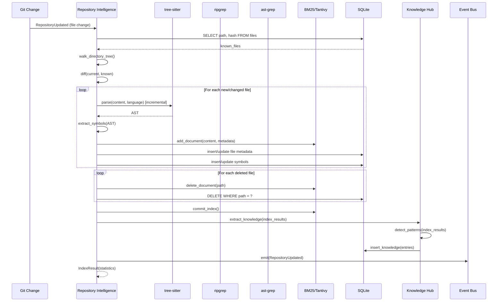

### Delta Detection

1. Query SQLite for all known file paths and hashes
2. Walk current filesystem
3. Compute three sets:
   - **New files**: in filesystem, not in database
   - **Changed files**: in both, but hash differs
   - **Deleted files**: in database, not in filesystem
4. Process each set accordingly

---

## Flow 2: Pre-Generation (BuildContext)

### Trigger

- Agent's pre-generation hook fires (e.g., `chat.message`, `UserPromptSubmit`)

### Sequence

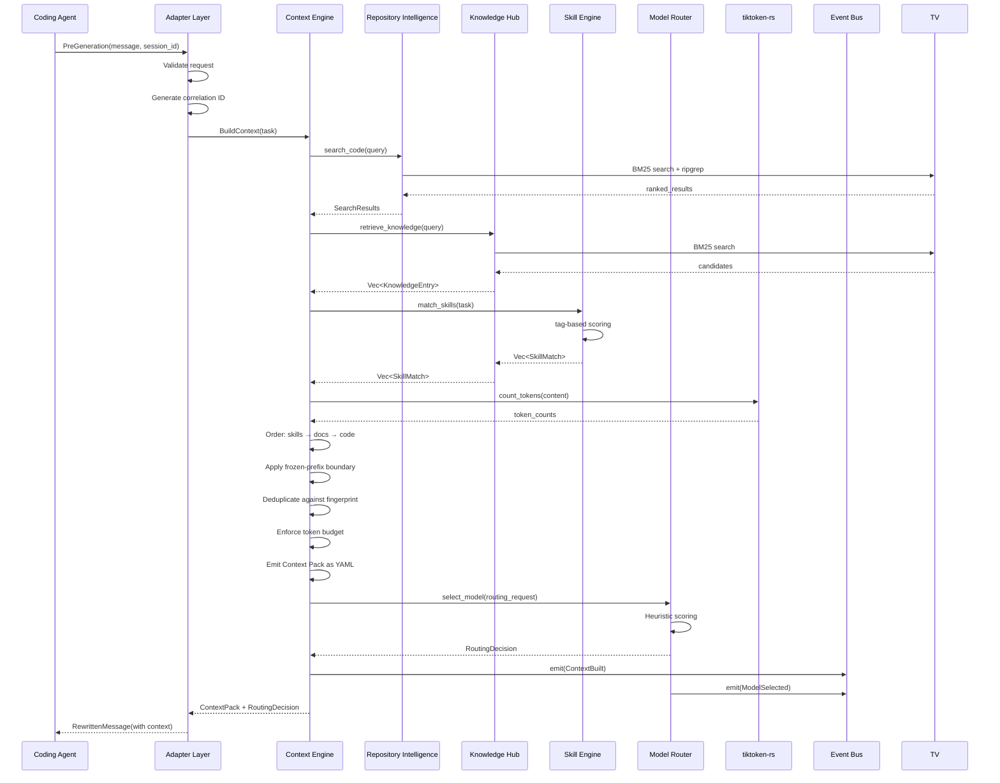

---

## Flow 3: Pre-Tool (Tool Output Compression)

### Trigger

- Agent's pre-tool hook fires (e.g., `tool.execute.before`, `PreToolUse`)

### Sequence

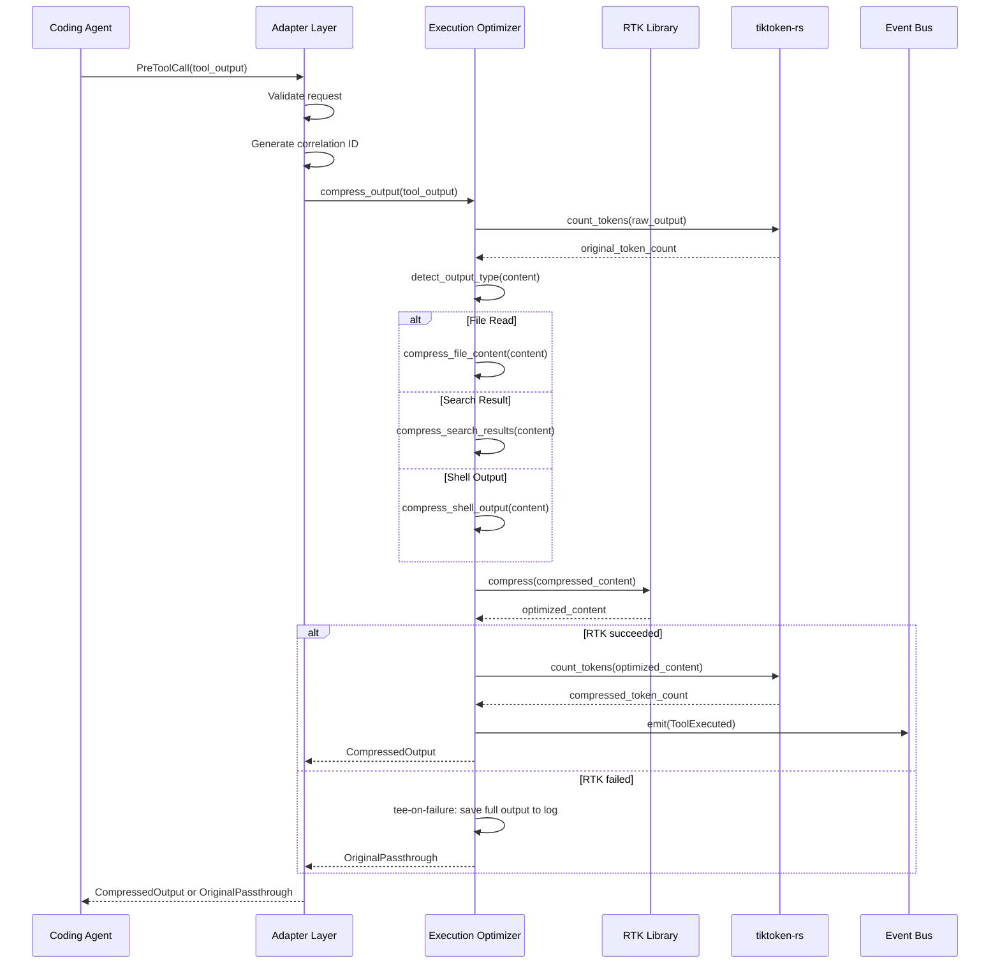

---

## Flow 4: Knowledge Retrieval

### Trigger

- Part of BuildContext pipeline (Flow 2)

### Sequence

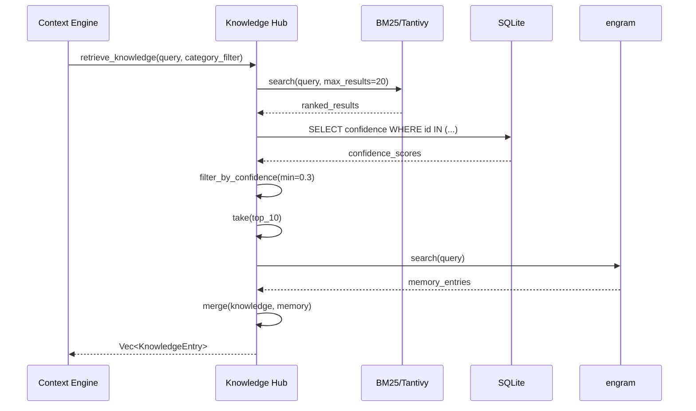

### KnowledgeEntry Structure

```json
{
  "id": 42,
  "category": "convention",
  "key": "naming_functions",
  "value": "Functions use camelCase naming convention",
  "confidence": 0.95,
  "source": "detected from 15 function definitions",
  "relevance_score": 0.87
}
```

---

## Flow 5: Skill Selection

### Trigger

- Part of BuildContext pipeline (Flow 2)

### Sequence

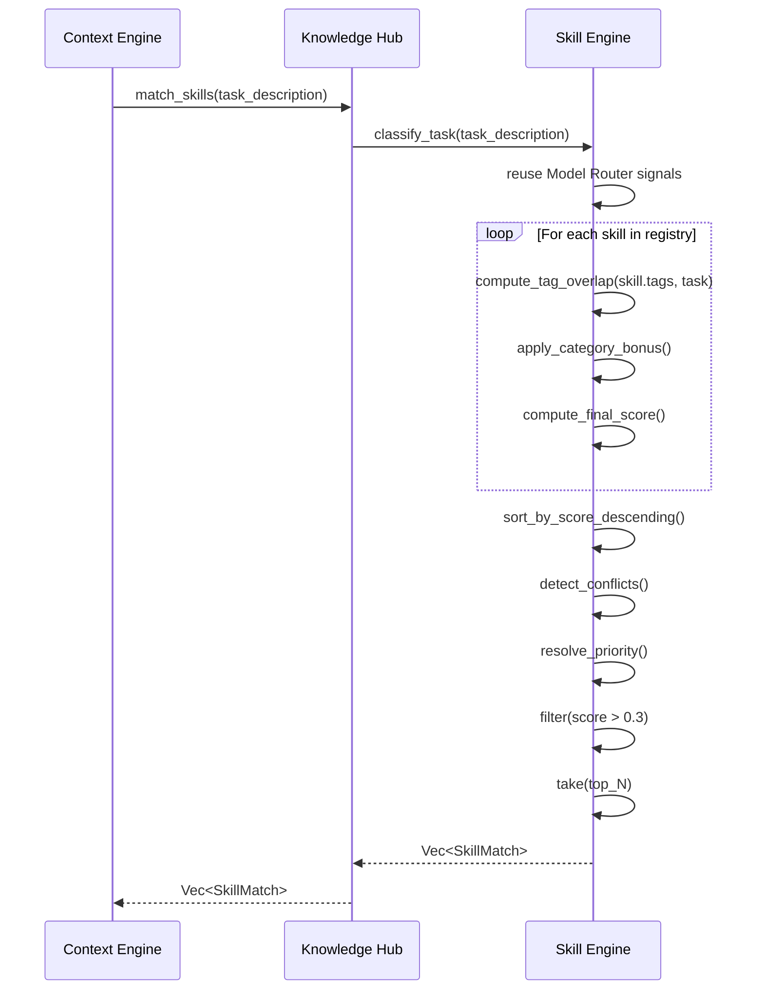

### SkillMatch Structure

```json
{
  "skill_name": "Add Rate Limiting",
  "match_score": 0.85,
  "instructions": "1. Check existing middleware patterns...",
  "examples": ["src/middleware/rate_limit.rs"],
  "constraints": ["Do not modify authentication logic"]
}
```

---

## Flow 6: Context Construction (Cache-Aware)

### Trigger

- Part of BuildContext pipeline (Flow 2)
- Orchestrates Flows 4 and 5

### Sequence

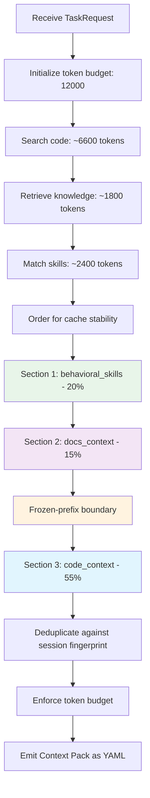

### Cache-Aware Ordering Detail

```
Context Pack Structure (YAML):

┌─────────────────────────────────────────────────┐
│ behavioral_skills                20%  2,400 tok │
│ ████████████████████████████████████████         │
│ (Most cache-stable: byte-identical across tasks)│
├─────────────────────────────────────────────────┤
│ docs_context                       15%  1,800 tok│
│ ████████████████████████████                     │
│ (Moderately stable: changes rarely)              │
├───────── FROZEN-PREFIX BOUNDARY ────────────────┤
│ code_context                       55%  6,600 tok│
│ ████████████████████████████████████████         │
│ ████████████████████████████████████████         │
│ ████████████████████████████████████████         │
│ (Least stable: changes frequently)               │
└─────────────────────────────────────────────────┘
```

### Code File Selection

1. Search Repository Intelligence with task description
2. Get top 20 candidate files
3. Score each file by:
   - Text match relevance (0.0–1.0)
   - Structural relevance (imports, function calls) (0.0–1.0)
   - File proximity (same directory = higher) (0.0–1.0)
4. Sort by composite score
5. Add files to context until code budget is exhausted
6. For each file, truncate to `max_lines_per_file` if needed

---

## Flow 7: Model Routing

### Trigger

- Part of BuildContext pipeline (Flow 2)
- After context assembly is complete

### Sequence

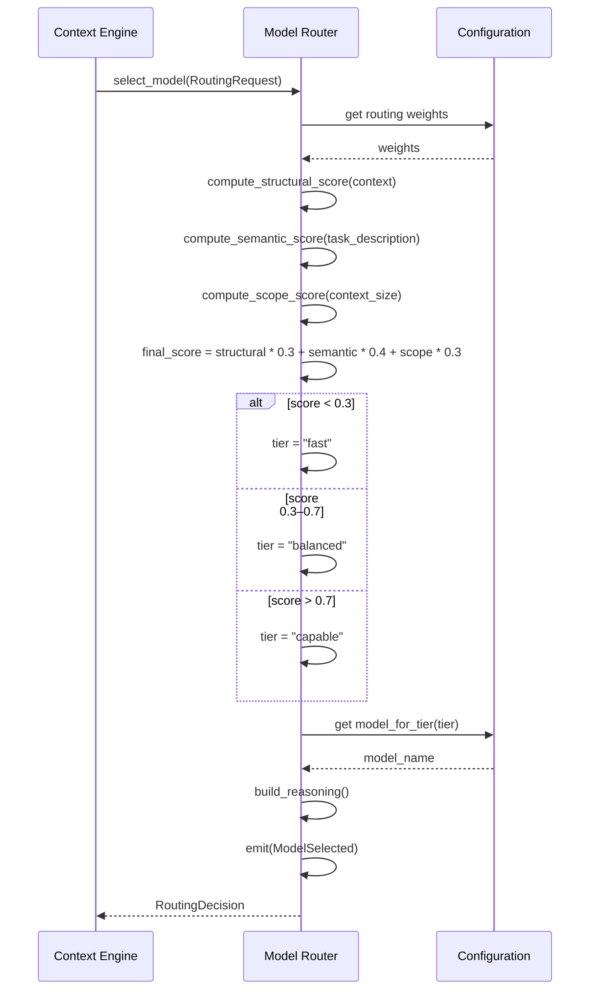

### RoutingDecision Structure

```json
{
  "model": "gpt-4o",
  "tier": "balanced",
  "scores": {
    "structural": 0.5,
    "semantic": 0.6,
    "scope": 0.4,
    "final": 0.51
  },
  "reasoning": "Moderate complexity: middleware creation with clear task description and moderate context size"
}
```

---

## Flow 8: Memory Operations

### Read (In Hot Path)

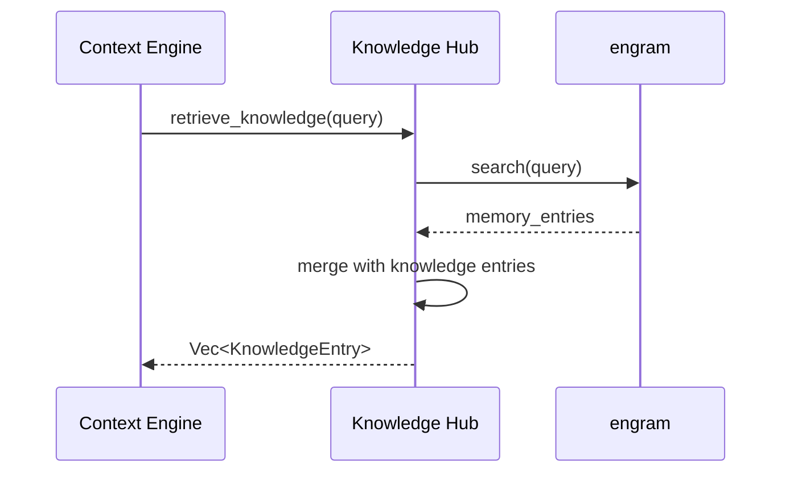

### Write (Agent-Invoked, Async)

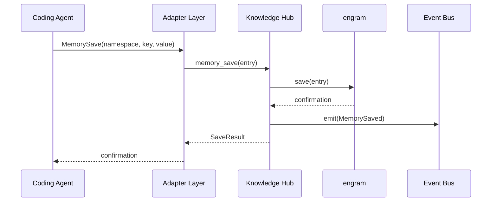

---

## Flow 9: Event Bus (Async Observability)

### Sequence

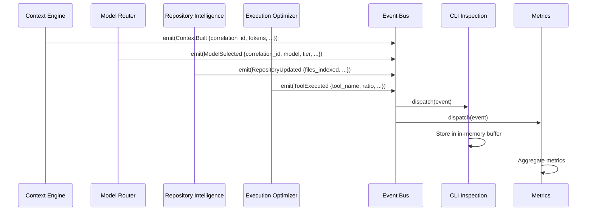

---

## Flow 10: Fail-Open (Timeout/Error)

### Trigger

- BuildContext exceeds 30s timeout
- Any unrecoverable error in the pipeline

### Sequence

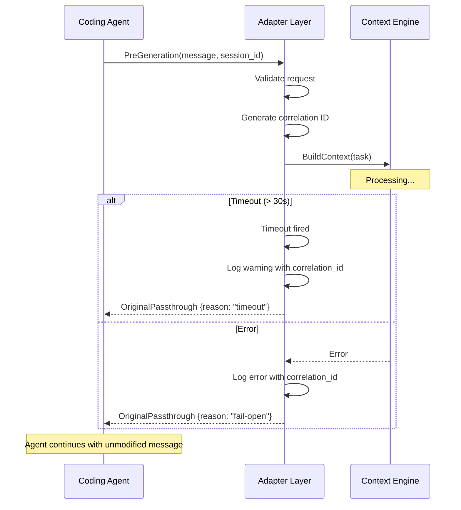

### Fail-Open Guarantees

| Condition | Response | Agent Impact |
|-----------|----------|--------------|
| BuildContext timeout | OriginalPassthrough | None — original message used |
| BuildContext error | OriginalPassthrough | None — original message used |
| Repository not indexed | OriginalPassthrough | None — original message used |
| LiteLLM unreachable | OriginalPassthrough | None — original message used |
| Any internal error | OriginalPassthrough | None — original message used |

The agent always gets a response. The runtime never blocks or breaks the agent.
