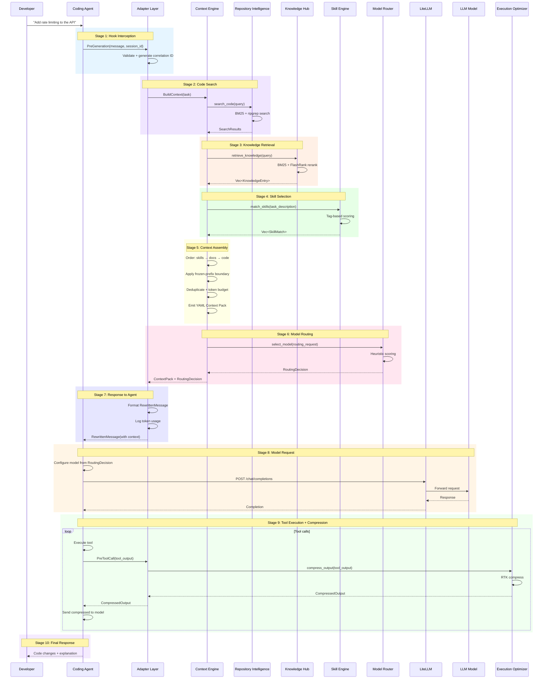
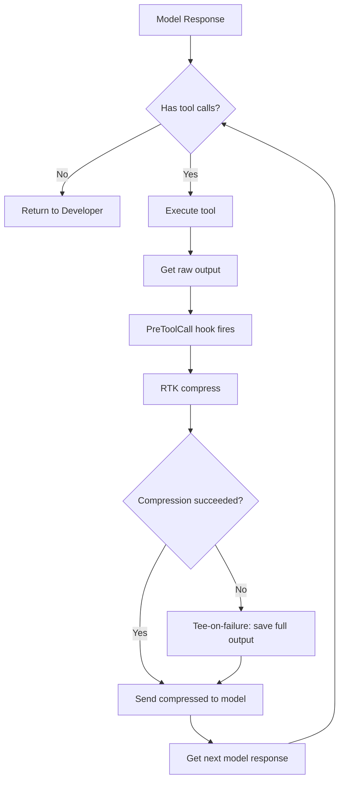

# Request Lifecycle

## Purpose

Define one complete request from user task to final response. Every stage is specified precisely with inputs, outputs, behavior, and error handling.

## Complete Lifecycle



---

## Stage 1: Hook Interception

### Entry Point

Developer provides a natural-language task to the coding agent. The agent's pre-generation hook fires before the model generates a response.

### Input

```json
{
  "hook_type": "PreGeneration",
  "session_id": "session_abc123",
  "message": "Add rate limiting to the API",
  "context_hints": {
    "files_mentioned": ["src/router.ts", "src/middleware/"],
    "language": "typescript"
  }
}
```

### Processing

1. Adapter Layer receives MessagePack-encoded request over UDS
2. Parse and validate request
3. Generate correlation ID: `req_{uuid_v4}`
4. Start tracing span with correlation ID
5. Log: `INFO hook_received correlation_id={id} hook_type=PreGeneration`

### Output

Internal `TaskRequest` struct passed to Context Engine.

### Errors

| Error | Response |
|-------|----------|
| Invalid MessagePack | OriginalPassthrough {reason: "invalid_request"} |
| Missing `message` | OriginalPassthrough {reason: "invalid_request"} |
| Missing `session_id` | OriginalPassthrough {reason: "invalid_request"} |

---

## Stage 2: Code Search

### Entry Point

Context Engine needs to find relevant code in the repository.

### Input

- Task description from message
- File hints from context_hints
- Language filter from context_hints

### Processing

1. Build search query from task description + file hints
2. Execute text search via ripgrep (in-process):
   - Pattern: key terms from task description
   - Scope: files matching language filter if provided
   - Ignore: .git, node_modules, target, etc.
3. Execute full-text search via BM25/tantivy (in-process):
   - Query: task description
   - Fields: content, symbols
   - Max results: 50
4. Merge results from both searches
5. Deduplicate by file path
6. Score each result:
   - ripgrep match: 0.5 base score
   - BM25 score: normalized to 0.0–1.0
   - File proximity bonus: +0.1 if in hinted directory
7. Sort by composite score descending
8. Return top 20 results
9. Log: `DEBUG code_search_completed results={count}`

### Output

```rust
SearchResults {
    results: Vec<SearchResult>,  // max 20
    total_matches: usize,
    search_duration_ms: u64,
}

SearchResult {
    file_path: String,
    line_start: usize,
    line_end: usize,
    score: f64,
    snippet: String,
    language: String,
}
```

### Errors

| Error | Behavior |
|-------|----------|
| ripgrep unavailable | Fatal — text search unavailable |
| BM25/tantivy search failure | Degraded — return ripgrep results only |
| No results found | Empty results, continue with other stages |

---

## Stage 3: Knowledge Retrieval

### Entry Point

Context Engine needs repository-specific knowledge to enrich the context.

### Input

- Task description
- Search results from Stage 2 (for context)
- Category filter: none (retrieve all categories)

### Processing

1. Build knowledge query from task description
2. Search BM25/tantivy knowledge index:
   - Query: task description
   - Max results: 20
3. Filter by confidence >= 0.3
4. If FlashRank available:
   - Rerank results using query as input
   - Take top 10
5. If FlashRank unavailable:
   - Use BM25 ranking as-is
   - Take top 10
6. Search engram for relevant memory entries
7. Merge knowledge entries with memory entries
8. Log: `DEBUG knowledge_retrieved entries={count}`

### Output

```rust
Vec<KnowledgeEntry>  // max 10

KnowledgeEntry {
    id: i64,
    category: String,       // "convention", "pattern", "domain", "decision"
    key: String,
    value: String,
    confidence: f64,
    source: Option<String>,
    relevance_score: f64,   // from search/rerank
}
```

### Errors

| Error | Behavior |
|-------|----------|
| BM25/tantivy search failure | Return empty list, log warning |
| FlashRank failure | Fall back to BM25 ranking |
| engram unreachable | Continue without memory |
| No knowledge found | Empty list, continue |

---

## Stage 4: Skill Selection

### Entry Point

Context Engine needs to find skills applicable to the task.

### Input

- Task description
- Context hints (files_mentioned, language)

### Processing

1. Classify task using shared signals (structural, semantic, scope)
2. For each skill in registry:
   a. Extract tag keywords
   b. Compute tag overlap score with task description
   c. Apply category bonus if task matches skill tags
   d. Compute final score
3. Sort by score descending
4. Detect conflicts between matched skills
5. Resolve priority (higher score wins)
6. Filter: score > 0.3
7. Take top N (configured, default 5)
8. Return full instructions (not just descriptions)
9. Log: `DEBUG skills_matched count={count} skills={names}`

### Output

```rust
Vec<SkillMatch>  // max 5

SkillMatch {
    skill_name: String,
    match_score: f64,
    instructions: String,
    examples: Vec<String>,
    constraints: Vec<String>,
}
```

### Errors

| Error | Behavior |
|-------|----------|
| No skills loaded | Return empty list |
| All scores below threshold | Return empty list |

---

## Stage 5: Context Assembly

### Entry Point

All retrieval stages complete. Context Engine assembles the final Context Pack.

### Input

- TaskRequest (message, hints)
- SearchResults (from Stage 2)
- Vec<KnowledgeEntry> (from Stage 3)
- Vec<SkillMatch> (from Stage 4)
- Session fingerprint (existing context)
- Token budget (from configuration)

### Processing

#### Step 1: Initialize Budget

```
total_budget = config.context.max_tokens  // default: 12000
remaining = total_budget
```

#### Step 2: Order for Cache Stability

Content is assembled in this fixed order for maximum prompt cache hit rates:

1. **behavioral_skills** (20% of budget) — Most cache-stable
2. **docs_context** (15% of budget) — Moderately stable
3. **Frozen-prefix boundary** — Marks where stable content ends
4. **code_context** (55% of budget) — Least stable

#### Step 3: Add Behavioral Skills

```
skills_budget = total_budget * 0.20  // 2400 tokens

for skill in matched_skills:
    skill_tokens = count_tokens(skill.instructions)
    if skill_tokens <= remaining AND skill_tokens <= skills_budget:
        add skill to behavioral_skills section
        remaining -= skill_tokens
        skills_budget -= skill_tokens
```

#### Step 4: Add Docs Context

```
docs_budget = total_budget * 0.15  // 1800 tokens

for entry in knowledge_entries:
    entry_tokens = count_tokens(entry.value)
    if entry_tokens <= remaining AND entry_tokens <= docs_budget:
        add entry to docs_context section
        remaining -= entry_tokens
        docs_budget -= entry_tokens
```

#### Step 5: Frozen-Prefix Boundary

All content above this line is cache-stable. Content below changes between tasks.

#### Step 6: Add Code Context

```
code_budget = total_budget * 0.55  // 6600 tokens

for result in search_results:
    file_content = read_file(result.file_path, result.line_start, result.line_end)
    content_hash = sha256(file_content)
    
    if content_hash in session_fingerprint:
        continue  // already sent
    
    file_tokens = count_tokens(file_content)
    if file_tokens <= remaining AND file_tokens <= code_budget:
        add file to code_context section
        remaining -= file_tokens
        code_budget -= file_tokens
        session_fingerprint.insert(content_hash)
```

#### Step 7: Finalize

```yaml
# Context Pack (YAML)
behavioral_skills:
  - name: "Add Rate Limiting"
    instructions: "1. Check existing middleware patterns..."
docs_context:
  - path: "docs/conventions.md"
    content: "All middleware follows the Express middleware signature..."
code_context:
  - path: "src/router.ts"
    content: "export function setupRoutes(router: Router) {...}"
    line_range: [1, 50]
    token_count: 800
```

### Output

```rust
ContextPack {
    behavioral_skills: Vec<SkillMatch>,
    docs_context: Vec<KnowledgeEntry>,
    code_context: Vec<CodeFile>,
    token_usage: TokenUsage,
}

TokenUsage {
    total_tokens: usize,
    budget_remaining: usize,
    by_source: HashMap<String, usize>,
}
```

### Errors

| Error | Behavior |
|-------|----------|
| File read failure | Skip file, log warning |
| Token counting failure | Use character-based estimation |
| Budget exceeded | Truncate last-added content |
| All sources empty | Return minimal context with task description only |

---

## Stage 6: Model Routing

### Entry Point

Context pack assembled. Need to select appropriate model.

### Input

- Task description
- Context pack size (total tokens)
- Number of files involved
- Number of knowledge entries
- Number of skills matched

### Processing

1. Compute structural complexity:
   ```
   file_count_score = min(context.code_context.len() / 10.0, 1.0)
   symbol_count_score = min(context.metadata.key_symbols.len() / 20.0, 1.0)
   structural = (file_count_score + symbol_count_score) / 2.0
   ```

2. Compute semantic complexity:
   ```
   task_length_score = min(task.len() / 200.0, 1.0)
   technical_terms = count_technical_terms(task)
   technical_score = min(technical_terms / 5.0, 1.0)
   action_verbs = count_action_verbs(task)
   action_score = min(action_verbs / 3.0, 1.0)
   semantic = (task_length_score + technical_score + action_score) / 3.0
   ```

3. Compute scope:
   ```
   token_score = min(context.token_usage.total_tokens / 10000.0, 1.0)
   knowledge_score = min(context.docs_context.len() / 10.0, 1.0)
   skill_score = min(context.behavioral_skills.len() / 5.0, 1.0)
   scope = (token_score + knowledge_score + skill_score) / 3.0
   ```

4. Compute final score:
   ```
   final = structural * 0.3 + semantic * 0.4 + scope * 0.3
   ```

5. Map to tier:
   ```
   if final < config.routing.fast_threshold:  // default 0.3
       tier = "fast"
   elif final > config.routing.capable_threshold:  // default 0.7
       tier = "capable"
   else:
       tier = "balanced"
   ```

6. Resolve model name:
   ```
   model = config.routing.{tier}_model
   ```

7. Apply override:
   ```
   if task_request.model_override:
       model = task_request.model_override
       tier = "overridden"
   ```

8. Log: `INFO model_routed tier={tier} model={model} score={final}`

### Output

```rust
RoutingDecision {
    model: String,          // "gpt-4o"
    tier: String,           // "balanced"
    scores: RoutingScores,
    reasoning: String,      // Human-readable explanation
}

RoutingScores {
    structural: f64,
    semantic: f64,
    scope: f64,
    final: f64,
}
```

### Errors

| Error | Behavior |
|-------|----------|
| Scoring failure | Return default (balanced, gpt-4o) |
| Configuration missing | Use default tier-to-model mapping |

---

## Stage 7: Response to Agent

### Entry Point

Context pack and routing decision ready. Format and return to agent.

### Input

- ContextPack from Stage 5
- RoutingDecision from Stage 6
- Correlation ID from Stage 1

### Processing

1. Assemble RewrittenMessage:
   ```
   response = RewrittenMessage {
       original: original_message,
       rewritten: inject_context(original_message, context_pack),
       context_pack: Some(context_pack),
       routing_decision: Some(routing_decision),
   }
   ```

2. Log token usage to SQLite

3. Emit ContextBuilt and ModelSelected events

4. Log: `INFO request_completed correlation_id={id} tokens={total} model={model}`

5. Return MessagePack response over UDS

### Output

The rewritten message includes the original message plus injected context:

```
[SYSTEM CONTEXT — Generated by Coderun Runtime]
Context Pack (8,500 tokens):
- 3 skills matched (Add Rate Limiting, Error Handling Pattern)
- 2 knowledge entries (middleware convention, API design pattern)
- 5 code files (router.ts, auth.ts, middleware/, config.ts, types.ts)
- Model: gpt-4o (balanced tier, score: 0.51)

[ORIGINAL MESSAGE]
Add rate limiting to the API
```

### Token Usage Tracking

Every request logs token usage to SQLite:

```sql
INSERT INTO token_usage (correlation_id, request_type, input_tokens, output_tokens, model, tier, created_at)
VALUES ('req_xyz789', 'context', 8500, 0, 'gpt-4o', 'balanced', '2025-01-15T10:30:00Z');
```

### Errors

| Error | Response |
|-------|----------|
| Context build failure | OriginalPassthrough (fail-open) |
| Model routing failure | Context with default model |
| Token logging failure | Return response, log warning |

---

## Stage 8: Model Request

### Entry Point

Coding agent receives the rewritten message and uses it to make a model request.

### Note

This stage is performed by the **coding agent**, not the runtime. The runtime provides the rewritten message with injected context. The agent uses this as input to its normal model request flow.

### Agent Processing

1. Receive rewritten message with injected context
2. Include in the model's prompt
3. Configure model from routing decision (if provided)
4. Send to model provider (through LiteLLM or directly)
5. Receive model response

### Agent Output

Model response with code changes, explanations, and tool calls.

---

## Stage 9: Tool Execution + Compression

### Entry Point

Model response contains tool calls (file reads, search, shell). Agent executes tools and the runtime compresses outputs before they re-enter context.

### Tool Execution Loop



### Compression Request

```json
{
  "tool_name": "read_file",
  "output_type": "file_read",
  "content": "import { Router } from 'express';\n// ... 500 lines ...",
  "context": "Looking for rate limiting middleware"
}
```

### Compression Response

```json
{
  "original": "// full content...",
  "compressed": "// src/router.ts (compressed)\nexport function setupRoutes(router: Router) {...}",
  "original_tokens": 2400,
  "compressed_tokens": 800
}
```

### Compression Example

| Output Type | Original Tokens | Compressed Tokens | Reduction |
|-------------|-----------------|-------------------|-----------|
| File read (large file) | 2,400 | 800 | 67% |
| Search results (20 matches) | 1,800 | 600 | 67% |
| Shell output (build log) | 3,200 | 400 | 87% |
| File read (small file) | 200 | 200 | 0% |

---

## Stage 10: Final Response

### Entry Point

Model has completed all tool calls and produced a final response.

### Processing

1. Agent assembles final response from model output
2. Agent applies code changes (file edits, creates)
3. Agent presents response to developer

### Developer Receives

- Code changes (diffs or new files)
- Explanation of changes
- Any warnings or notes from the model

### Runtime Side

After the request cycle completes:
1. Token usage logged to SQLite
2. Session fingerprint maintained for next request
3. Events emitted for observability
4. Logs written

---

## Timing Budget

| Stage | Target Duration | Maximum Duration |
|-------|-----------------|------------------|
| Stage 1: Hook Interception | < 2ms | 10ms |
| Stage 2: Code Search | < 50ms | 200ms |
| Stage 3: Knowledge Retrieval | < 30ms | 100ms |
| Stage 4: Skill Selection | < 10ms | 50ms |
| Stage 5: Context Assembly | < 50ms | 200ms |
| Stage 6: Model Routing | < 5ms | 20ms |
| Stage 7: Response | < 10ms | 50ms |
| **Total Runtime Overhead** | **< 160ms** | **< 30s (hard limit)** |
| Stage 8: Model Request | N/A (external) | N/A |
| Stage 9: Tool Compression | < 20ms per tool | 100ms per tool |
| Stage 10: Final Response | N/A (agent) | N/A |

### Hard Limits

- **Claude Code UserPromptSubmit**: 30 seconds. If exceeded, hook output is silently discarded.
- **Target latency**: Low single digits (1–5 seconds typical).
- **Fail-open**: On any timeout or error, return OriginalPassthrough.

---

## Correlation

Every log entry across all stages includes the correlation ID. This enables:

1. Tracing a single request through all modules
2. Aggregating token usage per request
3. Debugging performance issues per request
4. Correlating errors across modules

### Log Example for One Request

```json
{"level":"info","correlation_id":"req_xyz789","module":"adapter","message":"hook_received","hook_type":"PreGeneration"}
{"level":"debug","correlation_id":"req_xyz789","module":"repository_intelligence","message":"code_search_completed","results":12,"duration_ms":35}
{"level":"debug","correlation_id":"req_xyz789","module":"knowledge_hub","message":"knowledge_retrieved","entries":3,"duration_ms":18}
{"level":"debug","correlation_id":"req_xyz789","module":"skill_engine","message":"skills_matched","skills":["Add Rate Limiting"],"count":1,"duration_ms":4}
{"level":"debug","correlation_id":"req_xyz789","module":"context_engine","message":"context_pack_built","total_tokens":8500,"budget_remaining":3500,"order":"skills→docs→code"}
{"level":"info","correlation_id":"req_xyz789","module":"model_router","message":"model_routed","model":"gpt-4o","tier":"balanced","score":0.51}
{"level":"info","correlation_id":"req_xyz789","module":"adapter","message":"request_completed","total_tokens":8500,"model":"gpt-4o","latency_ms":127}
```

---

## Implementation Contract

### Rules for Coding AI Implementation

The following rules are **mandatory** for any coding AI implementing this specification:

1. **Do not deviate from the specified module structure.** Each module has a defined purpose and boundaries. Do not merge modules or split them differently.

2. **Do not introduce abstractions not specified.** No plugin systems, no dependency injection frameworks, no generic interfaces beyond what is documented.

3. **Use the specified technology stack.** Do not substitute libraries unless a documented technical reason exists. If substitution is necessary, document the reason and update this specification.

4. **Implement error handling as specified.** Every error code and behavior is defined. Do not add new error codes without updating this specification.

5. **Implement fail-open as specified.** On any timeout or error, return OriginalPassthrough. The agent must never be blocked or broken.

6. **Implement logging as specified.** Every module logs at the specified levels with the specified correlation ID propagation.

7. **Implement the token budget system exactly.** The budget allocation percentages and priority order are fixed for v1.

8. **Implement the model routing algorithm exactly.** The scoring formula and tier thresholds are fixed for v1.

9. **Implement the skill matching algorithm exactly.** The tag scoring and category bonus are fixed for v1.

10. **Implement the cache-aware ordering exactly.** The order skills → docs → code with frozen-prefix boundary is fixed for v1.

11. **Do not add features not in scope.** If a feature is listed in SCOPE.md as out of scope, do not implement it.

12. **Write tests for every public operation.** Each module's public operations must have unit tests.

13. **Write integration tests for the full request lifecycle.** End-to-end tests must cover Stages 1–7.

14. **Do not use unsafe Rust.** The entire implementation must be safe Rust.

15. **Do not panic in production code.** Use proper error handling with Result types.

16. **Document all public APIs.** Every public struct, function, and trait must have doc comments.

17. **Use the specified database schema.** Do not modify the schema without updating this specification.

18. **Use the specified configuration format.** Do not add configuration options without updating this specification.

19. **Test with Promptfoo for evaluation.** Model routing accuracy and context quality must be evaluated with Promptfoo.

20. **Performance targets are mandatory.** The timing budget in this document defines acceptable performance. Target low single digits; hard limit 30 seconds.

21. **Implement the daemon model.** The Context Engine runs as a long-lived daemon with Unix socket IPC, not spawn-per-request.

22. **Embed native Rust crates.** tree-sitter, ast-grep, and ripgrep are embedded as native Rust crates, not shelled out to per call.

23. **Use in-process reranking.** FlashRank runs in-process via `ort`, not as a separate service.

24. **Implement tee-on-failure for RTK.** On compression failure, save full output to log and return original.

25. **Report savings honestly.** Separate "reduction in the specific thing measured" from "reduction in your bill."
