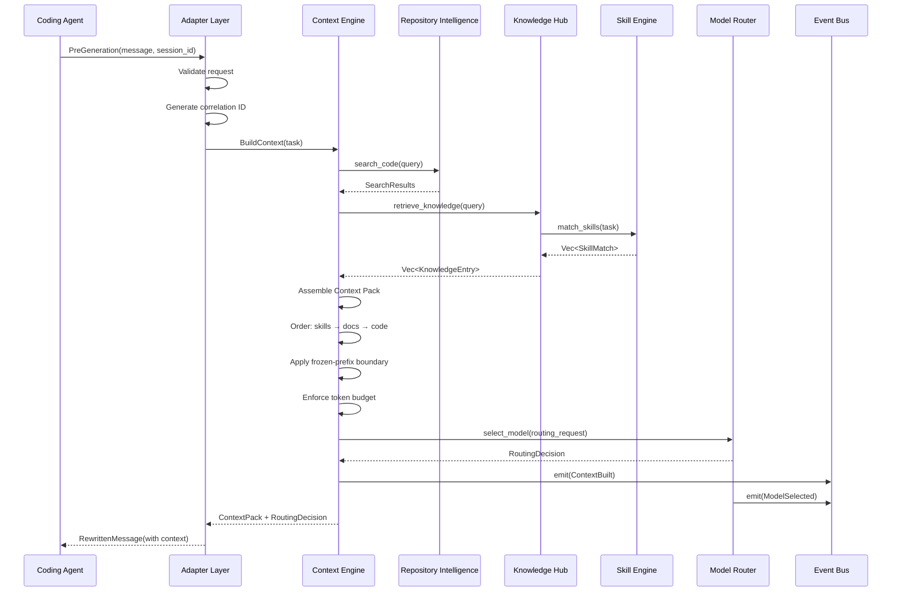
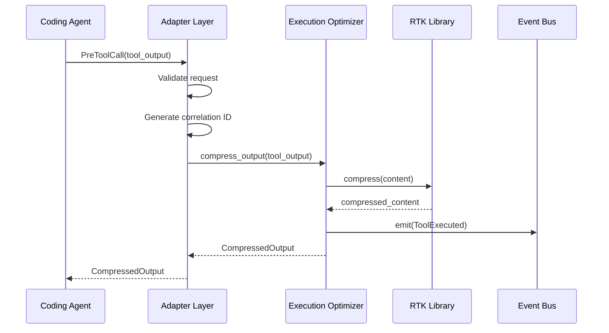

# Runtime

## Purpose

Define how the AI Runtime operates as a local daemon application. This document specifies the process lifecycle, configuration loading, repository initialization, IPC protocol, request handling, shutdown, persistence, logging, error handling, and fail-open behavior.

## Process Model

### Single Daemon Process

The runtime runs as a single Rust daemon process. The daemon hosts a Unix domain socket server that accepts connections from coding agents. All module logic executes within this process using async tasks on the tokio runtime.

### Process Lifecycle

```
Start (coderun serve)
  │
  ├── Load configuration
  ├── Initialize logging
  ├── Open/create SQLite database
  ├── Open/create engram
  ├── Open/create Tantivy index
  ├── Load skill definitions
  ├── Start Repository Intelligence (background index)
  ├── Start Unix socket server
  ├── Emit RepositoryUpdated event
  │
  │   ┌─── Running ───────────────────────────────────────┐
  │   │                                                    │
  │   │   Accept agent connections (UDS)                   │
  │   │   Handle pre-generation hooks (BuildContext)       │
  │   │   Handle pre-tool hooks (compress output)          │
  │   │   Emit observability events                        │
  │   │   Background: incremental indexing on git change   │
  │   │                                                    │
  │   └────────────────────────────────────────────────────┘
  │
  │   Signal: SIGINT / SIGTERM / Ctrl+C
  │
  ├── Stop accepting new connections
  ├── Drain in-flight requests (max 30s)
  ├── Flush Tantivy index
  ├── Close SQLite connection
  ├── Flush logs
  └── Exit
```

### Signal Handling

| Signal | Behavior |
|--------|----------|
| SIGINT | Graceful shutdown: stop accepting, drain in-flight, exit |
| SIGTERM | Graceful shutdown: stop accepting, drain in-flight, exit |
| SIGHUP | Reload configuration from disk |
| SIGUSR1 | Force re-index repository |

## Startup Sequence

### Step 1: Configuration Loading

```
1. Check for project-local config: .coderun/config.toml
2. Check for user config: ~/.config/coderun/config.toml
3. Check for environment variables: CODERUN_*
4. Merge in order: user < project < environment
5. Validate all required fields are present
6. Fail with clear error message if required fields are missing
```

### Step 2: Logging Initialization

```
1. Read log level from configuration (default: INFO)
2. Initialize tracing subscriber with:
   - stdout layer (structured JSON)
   - optional file layer (if log_path configured)
   - optional stderr layer (for ERROR level)
3. Set global default for correlation ID propagation
```

### Step 3: Database Initialization

```
1. Open SQLite at configured path (default: ~/.coderun/data.db)
2. Create tables if they do not exist (migration 001)
3. Set WAL mode for concurrent reads
4. Initialize connection pool (max 5 connections)
5. Verify database is readable and writable
```

### Step 4: engram Initialization

```
1. Start engram process (Go binary) if not already running
2. Verify engram HTTP API is reachable
3. Initialize memory namespace for current repository
4. Verify read/write capability
```

### Step 5: Index Initialization

```
1. Check if Tantivy index exists at configured path
2. If exists: open index
3. If not exists: create index with defined schema
4. Verify index is readable
```

### Step 6: Skill Loading

```
1. Read skill directory path from configuration
2. Scan for community-format skill files (.md, .toml, .yaml)
3. Parse each skill definition
4. Validate skill schema (name, trigger/tags, instructions required)
5. Load valid skills into Skill Engine registry
6. Log count of loaded skills
7. Warn on invalid skill files, skip them
```

### Step 7: Repository Indexing (Background)

```
1. Check if repository is already indexed (SQLite metadata)
2. If indexed: compare file hashes, identify changes
3. If not indexed: schedule full index
4. Index runs in background tokio task:
   a. Walk repository directory tree
   b. Skip .git, node_modules, target, __pycache__, .venv
   c. Parse each source file with tree-sitter (incremental)
   d. Extract symbols, imports, structure
   e. Add to BM25/tantivy index
   f. Store metadata in SQLite
   g. Detect project type and conventions
5. Emit RepositoryUpdated event when complete
6. Log indexing statistics
```

### Step 8: Unix Socket Server Start

```
1. Create Unix socket at configured path (default: /tmp/coderun.sock)
2. Set socket permissions (owner read/write only)
3. Start accepting connections
4. Log server startup with socket path
5. Ready to serve requests
```

## Configuration

### Configuration File Locations

| Priority | Path | Purpose |
|----------|------|---------|
| 1 (lowest) | `~/.config/coderun/config.toml` | User-wide defaults |
| 2 | `.coderun/config.toml` | Project-specific overrides |
| 3 (highest) | Environment variables `CODERUN_*` | Runtime overrides |

### Configuration Schema

```toml
# ~/.config/coderun/config.toml

[daemon]
socket_path = "/tmp/coderun.sock"    # Unix socket path
max_concurrent = 10                   # Max concurrent requests
request_timeout_ms = 30000            # Max time for BuildContext (fail-open)

[database]
path = "~/.coderun/data.db"          # SQLite database path
max_connections = 5                   # Connection pool size

[index]
path = "~/.coderun/index/"           # Tantivy index directory
languages = ["rust", "typescript", "javascript", "python", "go", "java", "c", "cpp"]

[knowledge]
memory_enabled = true                 # Enable engram memory
memory_endpoint = "http://localhost:9090"  # engram HTTP API endpoint
max_knowledge_entries = 10000         # Max knowledge entries

[skills]
path = ".coderun/skills/"            # Skill definitions directory
auto_discover = true                  # Auto-discover skill files
max_skills_per_request = 5           # Max skills injected per request

[context]
max_tokens = 12000                    # Max tokens per Context Pack
max_files = 20                        # Max files in Context Pack
max_lines_per_file = 500             # Max lines per file in Context Pack
cache_order = ["behavioral_skills", "docs_context", "code_context"]  # Fixed order

[model]
default_tier = "balanced"            # Default model tier
routing_enabled = true                # Enable model routing
max_tokens_response = 4096            # Max tokens in model response

[routing]
# Task complexity scoring weights
structural_weight = 0.3
semantic_weight = 0.4
scope_weight = 0.3

# Model tier thresholds
fast_threshold = 0.3                  # Score below this = fast tier
capable_threshold = 0.7              # Score above this = capable tier

# Model tier mappings
fast_model = "gpt-4o-mini"
balanced_model = "gpt-4o"
capable_model = "o1"

[litellm]
endpoint = "http://localhost:4000"    # LiteLLM endpoint
timeout_ms = 30000                    # Request timeout
max_retries = 3                       # Max retries on failure

[rtk]
enabled = true                        # Enable RTK compression
max_output_tokens = 8000              # Max tokens per compressed output
compression_level = "balanced"        # light, balanced, aggressive

[logging]
level = "info"                        # Log level: error, warn, info, debug, trace
file_path = "~/.coderun/logs/coderun.log"  # Log file path
max_size_mb = 100                     # Max log file size
retention_days = 7                    # Log retention
```

### Environment Variables

| Variable | Overrides | Default |
|----------|-----------|---------|
| `CODERUN_DAEMON_SOCKET` | daemon.socket_path | /tmp/coderun.sock |
| `CODERUN_DATABASE_PATH` | database.path | ~/.coderun/data.db |
| `CODERUN_LOG_LEVEL` | logging.level | info |
| `CODERUN_MODEL_DEFAULT` | model.default_tier | balanced |
| `CODERUN_CONTEXT_MAX_TOKENS` | context.max_tokens | 12000 |
| `CODERUN_LITELLM_URL` | litellm.endpoint | http://localhost:4000 |
| `CODERUN_ENGRAM_ENDPOINT` | knowledge.memory_endpoint | http://localhost:9090 |

## IPC Protocol

### Unix Domain Socket

The daemon communicates with coding agents over a Unix domain socket using MessagePack encoding.

### Message Format

```rust
// Request from agent to daemon
struct AgentRequest {
    correlation_id: String,           // req_{uuid}
    hook_type: HookType,              // PreGeneration | PreToolCall
    payload: RequestPayload,          // MessageRewrite | ToolOutput
}

// Response from daemon to agent
struct AgentResponse {
    correlation_id: String,
    hook_type: HookType,
    payload: ResponsePayload,         // RewrittenMessage | CompressedOutput | OriginalPassthrough
    latency_ms: u64,
    error: Option<String>,            // Non-fatal error message
}

enum HookType {
    PreGeneration,
    PreToolCall,
}

enum RequestPayload {
    MessageRewrite {
        session_id: String,
        message: String,
        context_hints: Option<ContextHints>,
    },
    ToolOutput {
        tool_name: String,
        output_type: OutputType,      // FileRead | SearchResult | ShellOutput | Other
        content: String,
        context: Option<String>,      // What the agent was looking for
    },
}

enum ResponsePayload {
    RewrittenMessage {
        original: String,
        rewritten: String,
        context_pack: Option<ContextPack>,
        routing_decision: Option<RoutingDecision>,
    },
    CompressedOutput {
        original: String,
        compressed: String,
        original_tokens: usize,
        compressed_tokens: usize,
    },
    OriginalPassthrough {
        original: String,
        reason: String,               // "timeout" | "error" | "fail-open"
    },
}
```

### Fail-Open Behavior

On any error or timeout, the daemon returns `OriginalPassthrough` with the original message unchanged. The agent always gets a response.

| Condition | Response | Reason |
|-----------|----------|--------|
| BuildContext timeout (> 30s) | OriginalPassthrough | "timeout" |
| BuildContext error | OriginalPassthrough | "error" |
| Context Engine failure | OriginalPassthrough | "fail-open" |
| Repository not indexed | OriginalPassthrough | "fail-open" |
| LiteLLM unreachable | OriginalPassthrough | "fail-open" |
| Any internal error | OriginalPassthrough | "fail-open" |

## Request Handling

### Pre-Generation Request Flow



### Pre-Tool Request Flow



## Shutdown

### Graceful Shutdown Sequence

```
1. Receive SIGINT/SIGTERM
2. Set shutdown flag (atomic bool)
3. Stop accepting new UDS connections
4. Wait for in-flight requests to complete (max 30 seconds)
5. If requests still in-flight after 30s:
   a. Log warning for each in-flight request
   b. Force completion
6. Flush Tantivy index (merge pending segments)
7. Close SQLite connection pool
8. Stop engram process (if started by daemon)
9. Flush log buffers
10. Remove Unix socket file
11. Log shutdown complete
12. Exit with code 0
```

### Force Shutdown

If the process receives a second signal during graceful shutdown:
1. Log immediate shutdown
2. Exit with code 1

## Persistence

### SQLite Schema (Migration 001)

```sql
-- Files tracked in the repository
CREATE TABLE files (
    id INTEGER PRIMARY KEY AUTOINCREMENT,
    path TEXT NOT NULL UNIQUE,
    hash TEXT NOT NULL,
    size INTEGER NOT NULL,
    language TEXT,
    last_indexed_at TEXT NOT NULL,
    created_at TEXT NOT NULL DEFAULT CURRENT_TIMESTAMP
);

-- Symbols (functions, classes, structs, etc.)
CREATE TABLE symbols (
    id INTEGER PRIMARY KEY AUTOINCREMENT,
    file_id INTEGER NOT NULL REFERENCES files(id),
    name TEXT NOT NULL,
    kind TEXT NOT NULL,
    line_start INTEGER NOT NULL,
    line_end INTEGER NOT NULL,
    parent_id INTEGER REFERENCES symbols(id),
    created_at TEXT NOT NULL DEFAULT CURRENT_TIMESTAMP
);

-- Token usage tracking
CREATE TABLE token_usage (
    id INTEGER PRIMARY KEY AUTOINCREMENT,
    correlation_id TEXT NOT NULL,
    request_type TEXT NOT NULL,
    input_tokens INTEGER NOT NULL,
    output_tokens INTEGER NOT NULL,
    model TEXT NOT NULL,
    tier TEXT NOT NULL,
    created_at TEXT NOT NULL DEFAULT CURRENT_TIMESTAMP
);

-- Indexes
CREATE INDEX idx_files_path ON files(path);
CREATE INDEX idx_files_hash ON files(hash);
CREATE INDEX idx_symbols_file_id ON symbols(file_id);
CREATE INDEX idx_symbols_name ON symbols(name);
CREATE INDEX idx_token_usage_correlation ON token_usage(correlation_id);
```

### engram Memory Schema

engram manages its own SQLite+FTS5 schema. The runtime stores:

| Namespace | Content |
|-----------|---------|
| `conventions` | Coding conventions detected from repository |
| `patterns` | Architectural patterns detected from repository |
| `domain_terms` | Domain-specific terminology definitions |
| `decisions` | Architectural decisions and their rationale |

### Tantivy Index Schema

```rust
Schema::builder()
    .add_text_field("content", TEXT | STORED)      // Full file content
    .add_text_field("path", TEXT | STORED)          // File path
    .add_text_field("language", TEXT | STORED)      // Programming language
    .add_text_field("symbols", TEXT)                // Symbol names
    .add_i64_field("size", STORED)                 // File size
    .add_date_field("indexed_at", STORED)           // When indexed
    .build()
```

## Logging

### Log Format

Structured JSON format:

```json
{
  "timestamp": "2025-01-15T10:30:00Z",
  "level": "info",
  "correlation_id": "req_abc123",
  "module": "context_engine",
  "message": "Context Pack built",
  "details": {
    "files_included": 5,
    "knowledge_entries": 3,
    "skills_matched": 1,
    "total_tokens": 8500,
    "latency_ms": 12
  }
}
```

### Log Levels

| Level | When to Use |
|-------|-------------|
| ERROR | Component failure, request failure, database corruption |
| WARN | Recoverable issue, degraded performance, retry needed |
| INFO | Request lifecycle, indexing progress, model routing decision |
| DEBUG | Module decisions, search results, skill matching scores |
| TRACE | Full data flow, token counting, context assembly details |

## Error Handling

### Error Categories

| Category | Behavior | Example |
|----------|----------|---------|
| **Timeout** | Return OriginalPassthrough (fail-open) | BuildContext exceeds 30s |
| **Request Error** | Return OriginalPassthrough (fail-open) | Invalid request body |
| **Degraded** | Continue with reduced functionality, return partial context | Knowledge retrieval failed |
| **Transient** | Retry once, then fail-open | LiteLLM timeout |
| **Fatal** | Process exits with code 1 | SQLite corrupted, configuration invalid |

### Error Response Format

```json
{
  "correlation_id": "req_abc123",
  "payload": {
    "OriginalPassthrough": {
      "original": "original message",
      "reason": "fail-open: context engine timeout"
    }
  },
  "latency_ms": 30001,
  "error": "Context engine exceeded 30s timeout, passing through original message"
}
```

### Error Codes

| Code | Category | Description |
|------|----------|-------------|
| HOOK_TIMEOUT | Timeout | Pre-generation hook exceeded 30s |
| INVALID_REQUEST | Request Error | Request body validation failed |
| INDEX_NOT_READY | Degraded | Repository not yet indexed |
| CONTEXT_BUILD_FAILED | Degraded | Context assembly partial failure |
| MODEL_ROUTING_FAILED | Degraded | Could not select model, using default |
| LLM_UNAVAILABLE | Transient | LiteLLM or model provider unreachable |
| RTK_COMPRESSION_FAILED | Degraded | Tool output compression failed, return uncompressed |
| KNOWLEDGE_RETRIEVAL_FAILED | Degraded | Knowledge search failed, continue without knowledge |
| SKILL_MATCH_FAILED | Degraded | Skill matching failed, continue without skills |
| DATABASE_ERROR | Fatal | SQLite operations failed |
| INDEX_ERROR | Fatal | Tantivy operations failed |
| ENGRAM_UNAVAILABLE | Degraded | Memory system unreachable, continue without memory |
| CONFIGURATION_ERROR | Fatal | Invalid or missing configuration |
